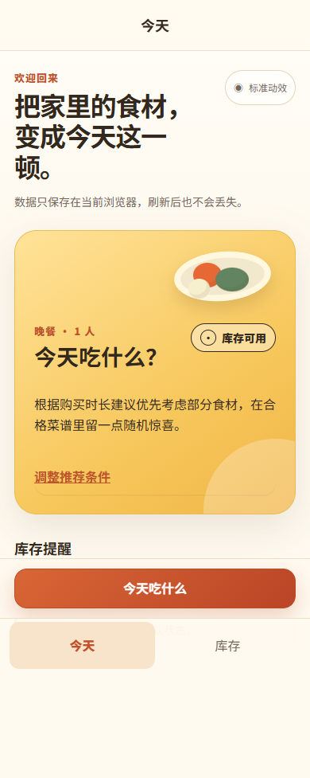
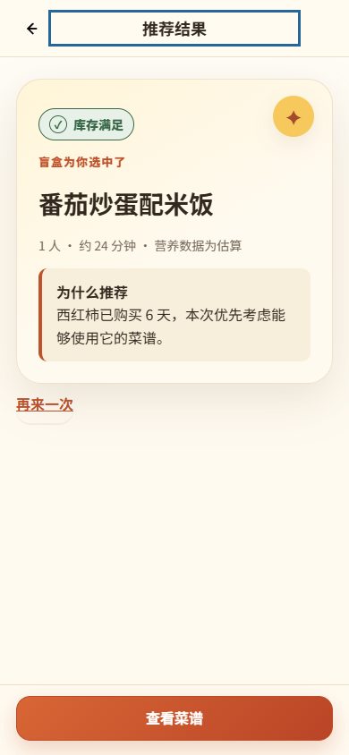
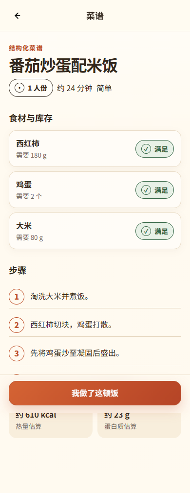
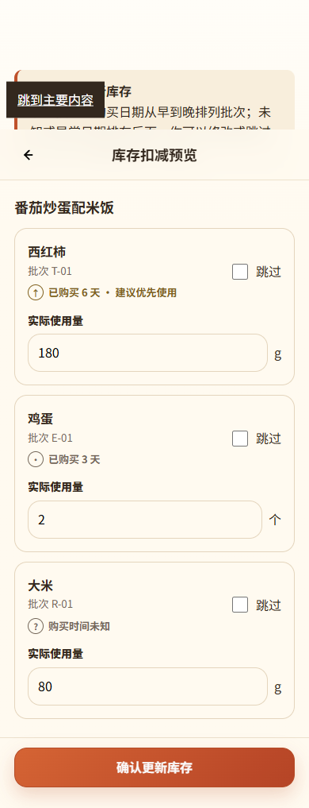

# 今天吃什么

> 一款以“可自定义的吃饭盲盒”为核心的移动优先网页应用：根据家中库存、用餐人数和饮食条件，在合理候选中随机推荐一顿饭，并在确认制作后更新库存。

**当前产品版本：V2.0** · 使用购买时长帮助优先消耗较早购入的食材，同时保持可解释、可编辑和非医疗级安全边界。

## Live Demo

- 在线体验：[https://1335389202-create.github.io/what-to-eat/](https://1335389202-create.github.io/what-to-eat/)
- GitHub 仓库：[https://github.com/1335389202-create/what-to-eat](https://github.com/1335389202-create/what-to-eat)

> 本项目使用 JavaScript ES Modules，**不能直接通过 `file://` 双击 `index.html` 打开**。本地预览必须使用 HTTP Server，具体方法见[本地运行](#本地运行)。

## 项目截图

| 首页 | 盲盒推荐结果 |
|---|---|
|  |  |

| 菜谱详情 | 库存扣减预览 |
|---|---|
|  |  |

## 核心功能

- 食材库存：手动添加、编辑、同名批次、数量精度、单位和可选购买日期。
- 购买时长：以本地自然日计算“正常 / 建议优先 / 已购买较久 / 未知或异常”，同时保留数量状态“满足 / 可能满足 / 不足 / 未知”。
- 推荐条件：1/2/4 人、午餐/晚餐、菜系、荤素、辣度、烹饪时间和库存模式。
- 条件盲盒：在符合硬条件的候选集合中随机抽取，并降低近期重复结果的权重。
- 库存四态：以文字、符号和颜色共同表达“满足 / 可能满足 / 不足 / 未知”。
- 结构化菜谱：按人数计算食材需求量，展示步骤、时间及估算营养信息。
- 制作闭环：确认制作、预览和编辑批次扣减、原子提交、失败保护及成功反馈。
- 本地持久化：库存、最近条件、推荐结果和动效偏好保存在 LocalStorage；Schema v1 可安全迁移到 v2。
- 数据恢复：迁移前备份旧 payload；损坏、读取失败、迁移失败和写入失败分别提示，重置必须二次确认。
- 可访问性：键盘操作、焦点管理、44px 触控目标、系统及显式 Reduce Motion。

## 核心用户流程

```text
首页
  → 食材库存
  → 推荐条件
  → 盲盒抽取
  → 推荐结果
  → 菜谱详情
  → 确认制作
  → 库存扣减预览
  → 原子更新库存
  → 更新后首页
```

当候选为空时，用户可以返回调整条件或补充库存；当库存写入失败时，应用保持提交前库存及用户编辑，允许返回修改或重试。

## 产品设计思路

普通菜谱工具要求用户先知道自己想找什么。本项目把核心问题改为“在少量真正重要的条件下，替用户做一次合理决定”。

- **库存优先**：先利用已有食材，并在数量可用时优先考虑购买较早的批次，减少浪费。
- **约束内随机**：趣味来自随机揭晓，实用性来自硬条件和库存匹配。
- **渐进设置**：默认条件可直接工作，更多条件按需展开，避免推荐前问卷化。
- **结果可解释**：推荐页说明库存状态、实际贡献的购买时长和补买估价，不将规则推荐伪装成 AI。
- **确认后扣减**：查看菜谱不会改变库存；只有用户确认后才进行一次性更新。

更完整的需求和体验决策见 [PRD.md](PRD.md)、[design-document.md](design-document.md) 与 [prototype-spec.md](prototype-spec.md)。

## V2.0 核心变化

- 库存批次以 `purchasedOn` 记录可选购买日期；不再把预计到期或“尽快食用”作为活跃推荐字段。
- 购买 0–4 天不加权，5–6 天加权 +2，7 天及以上加权 +3；每个候选只采用一个最高购买时长加分，避免多食材叠加放大。
- 推荐理由指向真实贡献食材；7 天及以上只提示“使用前请自行确认食材状态”，不推断保质期或食用安全。
- 扣减预览按已知购买日期从早到晚排序；未知、无效或未来日期稳定排在后面，用户仍可编辑或跳过。
- Schema v1 首次加载会备份并迁移至 v2，旧日期字段仅保存在 `legacy` 审计信息中，不反推购买日期。
- 数据损坏或迁移失败不会自动清空库存；用户可先重试，只有明确二次确认后才会恢复演示数据。

## Product Process

本项目保留从产品定义到可发布实现的完整决策链：

1. [PRD.md](PRD.md)：产品定位、MVP 边界与验收标准；
2. [design-document.md](design-document.md)：核心 UX 架构、状态与异常恢复；
3. [prototype-spec.md](prototype-spec.md) 与 [prototype/](prototype/)：24 Frame、五条核心流程和 76/76 独立原型基线；
4. [V2.0 迭代计划](docs/iterations/v2.0-plan.md)：基于 V1.0 复盘与竞品研究冻结购买时长问题；
5. [V2.0 实施计划](docs/iterations/v2.0-implementation-plan.md)：Schema、迁移、推荐、扣减、UI 与发布门禁。

产品版本与 Git 发布标签分层管理：Product V2.0 描述用户可感知的产品迭代，正式发布标签将使用语义版本 `v2.0.0`。

## Metrics to Validate

当前仓库没有真实用户分析数据，以下指标保持待验证，不伪造结果：

- 用户从首页到获得推荐结果的完成率与用时；
- 推荐理由的理解率，以及“建议优先使用”对最终选择的影响；
- 购买日期填写率、未来日期纠错率与“购买时间未知”的可理解性；
- 扣减预览的编辑/跳过比例及扣减失败后的恢复成功率；
- Schema v1 迁移提示理解率，以及用户主动重置前的取消比例。

## 技术方案

- 原生 HTML、CSS、JavaScript ES Modules
- Hash 路由，适配 GitHub Pages 仓库子路径和静态刷新
- LocalStorage 版本化单文档、校验、迁移、损坏恢复和写入失败回滚
- 静态 Mock 菜谱数据与可解释规则推荐
- 无后端、无生产运行时依赖、无第三方 API、无 secret
- Playwright 浏览器验收与 Node 单元测试仅用于开发验证

交付目标优先级是：交付速度、稳定性、可维护性，然后才是技术复杂度。因此本阶段没有为了作品集展示迁移 React/Vite。

## 推荐机制简述

```text
用户条件过滤
  → 按人数缩放食材需求
  → 对照库存计算四态
  → 严格库存 / 补买预算筛选
  → 购买时长加权（每个候选只取最高一档）
  → 近期推荐降权
  → 从合格候选中随机抽取
```

“少量补买”使用的是**本顿饭补买总预算**，不是外出就餐的人均预算。食材价格仅为 Mock 估价。

## LocalStorage 数据策略

- 数据仅保存在当前浏览器和当前设备。
- 首次访问载入演示库存；恢复演示数据会先说明影响并要求二次确认。
- 当前文档为 Schema v2，主 key 为兼容历史继续沿用 `what-to-eat.portfolio.v1`。
- Schema v1 首次加载时先写入备份，再迁移并回读校验；旧批次购买日期保持未知，不做推断。
- 无法解析、结构损坏或迁移失败时不会自动覆盖原 payload，界面提供重试和明确确认后的恢复路径。
- 库存扣减先在副本上校验，再单次写入；写入失败不会产生部分扣减。
- 清除浏览器网站数据、使用隐私模式或更换设备都会导致本地数据不可用。

## 本地运行

### 方式一：Python（无需项目依赖）

在项目根目录运行：

```bash
python -m http.server 8000
```

Windows 如果使用 Python Launcher，也可以运行：

```powershell
py -m http.server 8000
```

然后访问：

`http://localhost:8000/`

停止服务时在终端按 `Ctrl+C`。

### 方式二：任意静态 HTTP Server

也可以使用编辑器的 Live Server、系统自带静态服务器或其他静态托管服务，根目录必须指向本仓库。

> 请勿直接双击 `index.html`。浏览器会通过 `file://` 加载页面，而 ES Modules 会受到安全策略限制。

## 运行测试

运行网站本身不需要 Node.js。只有参与开发并执行自动化测试时才需要 Node.js 18+：

```bash
npm install
npx playwright install chromium
npm test
npm run test:deployment
npm run test:release
```

当前 V2.0 本地 Release Candidate 验收结果：

- 主项目自动化：**151/151**
  - 存储与 Schema v1 → v2 迁移：14/14
  - 购买时长自然日规则：18/18
  - 推荐过滤、加权与解释：26/26
  - 批次排序与原子扣减：17/17
  - Portfolio 核心浏览器流程：30/30
  - V2.0 UI、迁移与损坏恢复：22/22
  - 响应式、无障碍与视觉质量：24/24
- V1.0 分支前 Portfolio 基线：**82/82**，相关核心流程断言继续保留并通过。
- 低保真 `prototype/` 独立基线：**76/76**。
- HTTP 与 GitHub Pages 仓库子路径部署烟测：**13/13**。
- 发布文件、V2.0 文档事实、相对路径和敏感信息预检：**14/14**。

这些结果属于本地 Release Candidate 证据，不表示 V2.0 已合并、部署或产生真实用户指标。

## 项目结构

```text
.
├─ index.html                    # 公开 Demo 入口
├─ src/
│  ├─ app.js                     # 页面渲染、Hash 路由与交互
│  ├─ storage.js                 # LocalStorage Schema v2、迁移与恢复
│  ├─ purchase-age.js            # 本地自然日购买时长规则
│  ├─ recommender.js             # 条件过滤、四态与加权随机推荐
│  ├─ deduction.js               # 批次预览与原子扣减
│  ├─ styles.css                 # 移动优先视觉与响应式
│  └─ data/recipes.js            # 20 道 Mock 菜谱
├─ assets/screenshots/           # README 产品截图
├─ tests/                        # 单元与浏览器验收
├─ prototype/                    # 已通过 76/76 的低保真过程资产
├─ PRD.md                        # 产品需求文档
├─ design-document.md            # UX 架构文档
├─ prototype-spec.md             # 可点击原型规格
├─ docs/iterations/              # V1.0 复盘与 V2.0 迭代记录
└─ CHANGELOG.md                  # 产品版本变化
```

## Portfolio MVP 范围

V2.0 仍只实现居家做饭核心闭环：库存管理、购买时长、推荐条件、盲盒推荐、菜谱、确认制作和库存更新。

项目包含 20 道具有代表性的中西式 Mock 菜谱，用于验证推荐逻辑和完整体验；不追求生产级内容规模。

## Roadmap

- 手机号验证码登录、云端数据库和跨设备同步
- AI 拍照识别、受限制 AI 辅助及菜谱生成
- 外出用餐、定位、地图、商圈和真实餐厅数据
- 第三方营养、食材价格和 POI API
- 完整随机菜单、买菜清单和采购入库
- 收藏、长期反馈、自定义菜谱完整管理
- 家庭共享、提醒推送、微信小程序和多城市支持

## 已知限制

- 菜谱、食材价格和补买金额均为 Mock / 演示数据。
- 热量和蛋白质属于估算值，不具备医疗或专业营养精度。
- LocalStorage 只支持单浏览器、单设备本地存储，不提供账户和云同步。
- 购买日期由用户输入或演示数据提供；购买时长不是保质期，应用不判断食材是否可安全食用。
- Schema v1 的旧到期/尽快食用字段不会被推断为购买日期，因此迁移后部分批次会显示“购买时间未知”。
- 推荐规则强调透明、可运行和可测试，不是 AI 推荐，也不是生产级个性化系统。
- 当前没有真实图片识别、登录、地图、餐厅、外卖或第三方营养服务。

## License

[MIT License](LICENSE)
