# 「今天吃什么」产品设计与 UX 架构文档

## 1. 文档信息

- 文档版本：V0.2
- 文档状态：已评审，进入低保真原型阶段
- 需求基准：`PRD.md` V0.2
- 设计阶段：产品设计与 UX 架构设计
- 适用范围：第一版小范围公开测试
- 终端范围：手机优先网页，兼容桌面浏览器
- 首发地域：居家功能不限城市；真实餐厅推荐限深圳市

本文档回答“用户如何使用产品，以及信息、页面、导航、状态和交互如何组织”。它不定义技术栈、数据库、API、第三方供应商、正式 Design System 或高保真视觉稿。

---

## 2. 设计目标

1. 让用户在首页即可理解当前推荐上下文，并用一次主操作开始推荐。
2. 将“库存 → 推荐 → 菜谱 → 制作 → 库存扣减”设计成可连续完成的首要闭环。
3. 用默认值、最近选择和长期偏好替代推荐前长表单。
4. 让库存状态、预算估算、营养估算和营业状态在不制造虚假精度的前提下易懂。
5. 让“先合理，后随机”在界面上可感知：随机有趣，但结果有理由、有边界、可恢复。
6. 游客可完成核心体验；登录只在需要云同步时出现，不成为首次体验门槛。
7. 外出推荐保持独立完整，但不抢占居家主线的信息优先级。
8. 为下一阶段 Figma 原型提供明确的 Frame、状态、Overlay 和 Prototype Link 依据。

### 2.1 第一版 UX 成功信号

- 新游客能在不填写完整档案的情况下完成首次有效推荐。
- 用户能理解“满足 / 可能满足 / 不足 / 未知”的差异并采取下一步行动。
- 用户能区分居家补买总预算、随机菜单采购总预算和外出人均预算。
- 用户知道查看菜谱不会扣库存，只有确认制作后才进入扣减。
- 外出定位被拒绝或第三方数据失败时，用户仍有手动地点或重试路径。
- AI 建议不会与原始菜谱混淆，AI 失败不阻断核心流程。

---

## 3. 设计原则

### 3.1 决策优先，不做菜谱搜索门户

首页不以搜索框或内容瀑布流为中心。搜索只服务库存录入、自定义菜谱或管理任务；核心入口始终是“今天吃什么”。

### 3.2 默认值先工作

主流程先展示一行可读的条件摘要，例如“今晚 · 2 人 · 尽量用库存”。用户点击摘要后再调整，不逐项询问。

### 3.3 安全条件显式处理

过敏原、明确不吃和饮食类型在首次关键使用前以短安全确认呈现。用户必须能明确选择“暂无限制”或进入设置，不能通过沉默推断为没有限制。

### 3.4 一个页面，一个最强主操作

页面可以有多个次要操作，但只有一个视觉上最明确的 CTA。危险操作、设置和反馈不与主操作竞争。

### 3.5 渐进披露

预算、营养、菜系、辣度、烹饪时间等默认收纳在“调整条件”中；结果页先给决策，再按需展开依据、缺少项和详细数据。

### 3.6 状态不只靠颜色

所有关键状态使用“文字标签 + 图形符号/形状 + 说明或动作”。颜色只作为辅助，不承担唯一语义。

### 3.7 不制造虚假精度

约数继续显示“约”；营养和采购金额显示“估算”；预算未知和营业未知直接说未知；AI 内容明确标记。

### 3.8 动效服务因果关系

盲盒动效只表达“已从合格候选中抽取”。动效短、可跳过、可中断；减少动态效果时直接呈现结果。

### 3.9 操作可恢复

无结果、库存不确定、定位失败、数据合并失败和扣减失败都提供下一步，不形成死路。

### 3.10 视觉原则与情绪关键词

- 情绪：温暖、松弛、可靠、有食欲、有生活感；
- 克制：不幼稚、不做夸张卡通、不用复杂老虎机或长转盘；
- 信息密度：首屏低密度，管理页中等密度，详情页按层级展开；
- 卡片感：卡片承载“库存摘要、推荐结果、餐厅结果”，避免所有内容都卡片化；
- 留白：围绕主决策保留呼吸感，管理列表强调扫描效率；
- 图片：食物图片服务识别与食欲，不遮盖状态、预算或约束信息；无可靠图片时使用稳定占位，不使用误导性配图；
- 动效性格：轻、快、带一点惊喜，结果可立即读取；
- 本阶段不确定具体颜色、字体、阴影、圆角或插画风格。

---

## 4. 用户与场景

### 4.1 核心用户

深圳居住或工作的年轻上班族，主要一至两人用餐，会做日常饭菜但库存维护不规律，同时存在工作日外出午餐或晚餐需求。

### 4.2 核心场景优先级

| 优先级 | 场景 | 用户任务 | 产品响应 |
|---|---|---|---|
| 主线 | 在家，尽量用现有库存 | 快速决定一顿饭并减少浪费 | 优先利用临期食材，展示数量满足状态与理由 |
| 主线扩展 | 在家，允许补买少量 | 用少量采购完成更合适菜单 | 展示缺少项、重要程度和补买总预算 |
| 补充 | 在家，不参考库存 | 直接获得随机菜单 | 复用同一条件、盲盒和菜谱结构，展示采购总预算 |
| 次线 | 外出，附近就餐 | 决定菜系或真实餐厅 | 请求定位或手动地点，展示人均预算和数据状态 |
| 次线 | 外出，指定区域 | 在深圳区域/商圈做决定 | 手动选点后抽菜系或餐厅 |

### 4.3 角色差异

- 游客：可以完成全部消费者主流程；页面持续但克制地说明数据仅保存在本设备。
- 登录用户：与游客页面结构一致，增加云同步状态和账户管理。
- 内部管理员：使用独立管理入口和导航，不出现在普通用户主导航中。

---

## 5. 信息架构

### 5.1 一级功能区域

```text
今天吃什么
├─ 今天：决策中心
│  ├─ 在家吃
│  │  ├─ 使用库存
│  │  └─ 不参考库存的随机菜单
│  └─ 外出吃
│     ├─ 附近就餐
│     └─ 指定区域
├─ 库存：个人食材资产
│  ├─ 我的库存
│  ├─ 快速添加 / 编辑 / 批次
│  └─ 常备基础项
└─ 我的：长期管理
   ├─ 收藏与我的菜谱
   ├─ 偏好与预算
   ├─ 永久屏蔽
   ├─ 登录与同步
   └─ 数据与账户

临时任务层
├─ 调整推荐条件
├─ 盲盒抽取
├─ 缺少食材详情
├─ AI 辅助建议
├─ 地点选择 / 定位授权
├─ 反馈
└─ 扣减预览与编辑

内部管理区
├─ 菜谱内容
├─ 食材主数据
├─ 用户反馈
├─ 餐厅屏蔽
└─ 权限与操作记录
```

### 5.2 信息层级原则

- 直接暴露：首页场景切换、当前条件摘要、临期提醒、主推荐按钮、库存快速添加。
- 二级收纳：菜系、辣度、时间、营养、三种预算、临期提前天数、常备项、永久屏蔽。
- 主流程页面：首页、库存、推荐条件、盲盒、推荐结果、菜谱、扣减预览、外出入口、地点、餐厅结果。
- 管理型页面：库存批次、我的菜谱、偏好、收藏、账户与数据、内部管理。
- 临时任务：条件 Sheet、快速添加、批次编辑、定位授权、反馈、AI 建议、扣减项编辑。
- 不为随机菜单、收藏、AI 或每一种偏好建立一级导航。

---

## 6. 导航模型

### 6.1 手机端主导航

底部导航使用三项：

1. **今天**：默认入口；在家/外出场景切换、当前上下文和快速推荐。
2. **库存**：库存查看、快速添加、批次和常备项。
3. **我的**：收藏、我的菜谱、偏好、屏蔽、登录与数据。

导航项始终使用图形符号与文字标签，不使用仅图标导航。盲盒、菜谱和扣减属于任务流页面，可暂时隐藏底部导航以集中注意力，但必须提供明确返回路径并保留之前状态。

### 6.2 次级导航

- “今天”页顶部使用在家/外出两段式场景切换；在家为首次默认。
- 库存页使用列表内分区或轻量标签切换“库存 / 常备项”，不增加底部入口。
- 我的页使用分组列表进入收藏、我的菜谱、偏好和账户。
- 详情页使用返回、标题和少量上下文操作，不叠加多层标签栏。

### 6.3 桌面端导航

- 三项主导航转为固定侧栏或紧凑顶部导航，语义和顺序不变。
- “在家 / 外出”仍是“今天”内容区内的场景切换，不提升为第二套全局导航。
- 管理详情可使用双栏：左侧列表/摘要，右侧详情/编辑。

### 6.4 返回与状态保持

- 返回推荐条件时保留已调整内容；返回结果时保留当前抽取结果。
- 从菜谱返回结果页时保持滚动位置和展开状态。
- 从外部地图返回时保留餐厅结果。
- 关闭 Sheet/Modal 后焦点回到触发控件。
- 浏览器后退行为与视觉返回一致，不静默跳回首页。

---

## 7. 页面清单与页面 ID

命名规则：模块缩写 + 两位序号。Sheet、Modal 和状态页也分配 ID，便于 Figma 与验收引用。

| ID | 页面名称 | 模块 | 页面目的 | 主要用户 | 主要入口 | 主要出口 | 主操作 | 次要操作 | MVP | 手机特殊设计 | 登录 |
|---|---|---|---|---|---|---|---|---|---|---|---|
| HOME-01 | 今天首页 | 首页 | 快速理解上下文并开始决策 | 全部 | 产品入口/主导航 | REC-01、OUT-01、INV-02 | 今天吃什么 | 切换场景、调整条件、查看临期 | 是 | 底部固定主 CTA、单手可达 | 否 |
| HOME-02 | 首次安全确认 | 首页 | 明确过敏原与饮食禁忌状态 | 新用户 | HOME-01 首次关键操作 | HOME-01、SET-02 | 确认并继续 | 添加限制、稍后处理说明 | 是 | Bottom Sheet，全屏阅读模式兼容 | 否 |
| INV-01 | 我的库存 | 库存 | 浏览、确认和维护个人库存 | 全部 | 主导航/HOME-01 | INV-02、INV-03、INV-04 | 添加食材 | 筛选、标记用完、进入常备项 | 是 | 浮动或底部添加入口 | 否 |
| INV-02 | 快速添加食材 | 库存 | 连续添加少量食材 | 全部 | HOME-01、INV-01 | INV-01、INV-03、INV-06 | 添加到库存 | 扫描常见项、补充详情 | 是 | 搜索聚焦、键盘友好 Bottom Sheet | 否 |
| INV-03 | 添加/编辑食材 | 库存 | 编辑名称、数量、单位、日期和标记 | 全部 | INV-01/02/04 | INV-01、INV-04、INV-06 | 保存食材 | 删除/标记用完 | 是 | 分组表单，次要字段折叠 | 否 |
| INV-04 | 食材批次详情 | 库存 | 查看同食材多批次并维护 | 全部 | INV-01/03 | INV-03、INV-01 | 更新批次 | 合并、新增批次、用完 | 是 | 卡片分批次、危险操作下沉 | 否 |
| INV-05 | 常备基础项 | 库存 | 管理默认认为可用的基础调料 | 全部 | INV-01、SET-01 | INV-01/SET-01 | 保存常备项 | 恢复建议项 | 是 | 搜索与开关列表 | 否 |
| INV-06 | 食材映射确认 | 库存 | 处理无法识别或可能误映射的名称 | 全部 | INV-02/03 | INV-03、INV-01 | 选择匹配项 | 保留自定义名称、反馈别名 | 是 | 单选列表 Sheet | 否 |
| REC-01 | 推荐条件 | 居家推荐 | 查看摘要并按需调整本次条件 | 全部 | HOME-01、结果页 | REC-02、HOME-01 | 开始抽取 | 恢复默认、保存为长期偏好 | 是 | Bottom Sheet，可扩展全屏 | 否 |
| REC-02 | 盲盒抽取 | 居家推荐 | 提供短暂仪式感并可立即看结果 | 全部 | REC-01/HOME-01 | REC-03、REC-04 | 查看结果 | 跳过动画 | 是 | 全屏轻量动效、Reduce Motion | 否 |
| REC-03 | 居家推荐结果 | 居家推荐 | 呈现一顿饭、理由和库存匹配 | 全部 | REC-02 | RCP-01、REC-01/02、COOK-01 | 查看菜谱 | 再来一次、收藏、反馈 | 是 | 主卡优先，详情折叠 | 否 |
| REC-04 | 居家无结果 | 居家推荐 | 解释冲突并提供恢复路径 | 全部 | REC-02 | REC-01、INV-02、RND-01 | 调整条件 | 添加库存、切换补买/随机菜单 | 是 | 单一恢复主操作 | 否 |
| REC-05 | 库存与缺少项详情 | 居家推荐 | 查看四态、判断依据与补买估算 | 全部 | REC-03/RCP-01 | REC-03、INV-03 | 确认库存信息 | 标记没有了、编辑数量 | 是 | Bottom Sheet 分组列表 | 否 |
| RCP-01 | 菜谱详情 | 菜谱 | 查看结构化食材、步骤与估算 | 全部 | REC-03、RND-02 | COOK-01、AI-01、REC-05 | 我做了这顿饭 | 收藏、AI 辅助、反馈 | 是 | 底部主 CTA，分段锚点 | 否 |
| AI-01 | AI 辅助建议 | AI | 提供替代、份量或步骤解释 | 全部 | RCP-01 | RCP-01、FBK-03 | 采用为本次参考 | 重试、报告问题、关闭 | 是 | Bottom Sheet/全屏，原文对照 | 否 |
| COOK-01 | 库存扣减预览 | 制作闭环 | 预览实际消耗和批次 | 全部 | RCP-01 | COOK-02、COOK-03/04 | 确认更新库存 | 修改、跳过某项、取消 | 是 | 底部确认 CTA | 否 |
| COOK-02 | 编辑扣减项 | 制作闭环 | 调整实际数量或批次 | 全部 | COOK-01 | COOK-01 | 保存调整 | 不扣除此项 | 是 | 单项 Sheet | 否 |
| COOK-03 | 库存更新成功 | 制作闭环 | 确认闭环完成并展示剩余摘要 | 全部 | COOK-01 | HOME-01、INV-01 | 完成 | 查看库存 | 是 | 成功反馈简短不阻塞 | 否 |
| COOK-04 | 库存更新失败 | 制作闭环 | 保留编辑并提供重试 | 全部 | COOK-01 | COOK-01、HOME-01 | 重试更新 | 暂不更新 | 是 | 错误原因与恢复同屏 | 否 |
| RND-01 | 随机菜单条件 | 随机菜单 | 在不参考库存时调整本次条件 | 全部 | HOME-01、REC-04 | REC-02、HOME-01 | 开始抽取 | 切换回库存推荐 | 是 | 复用 REC-01 结构 | 否 |
| RND-02 | 随机菜单结果 | 随机菜单 | 展示菜单、菜谱入口和采购总预算 | 全部 | REC-02 | RCP-01、RND-01 | 查看菜谱 | 再来一次、切回库存 | 是 | 复用 REC-03 卡片结构 | 否 |
| OUT-01 | 外出推荐入口 | 外出 | 选择附近/指定区域及抽取路径 | 全部 | HOME-01 | LOC-01、OUT-02/04 | 开始外出推荐 | 调整人均预算、切回在家 | 是 | 地点与方式优先 | 否 |
| LOC-01 | 地点选择 | 外出 | 获取当前位置或选择区域/常用地点 | 全部 | OUT-01 | OUT-01/02/04 | 使用此地点 | 定位、搜索、收藏地点 | 是 | Bottom Sheet/全屏搜索 | 否 |
| LOC-02 | 定位授权与失败 | 外出 | 解释用途并提供手动替代 | 全部 | LOC-01 | LOC-01 | 手动选择地点 | 重试定位 | 是 | 权限前说明，不循环弹窗 | 否 |
| OUT-02 | 菜系抽取 | 外出 | 以短动效决定菜系 | 全部 | OUT-01/LOC-01 | OUT-03 | 查看菜系结果 | 跳过动画 | 是 | 复用盲盒节奏 | 否 |
| OUT-03 | 菜系结果 | 外出 | 展示菜系并衔接餐厅抽取 | 全部 | OUT-02 | OUT-04、OUT-01 | 按此菜系选餐厅 | 换一个菜系 | 是 | 单一菜系结果卡 | 否 |
| OUT-04 | 餐厅抽取 | 外出 | 从合格真实餐厅中抽取 | 全部 | OUT-01/03 | OUT-05/06 | 查看餐厅 | 跳过动画 | 是 | 短动效、可中断 | 否 |
| OUT-05 | 餐厅推荐结果 | 外出 | 展示真实餐厅和数据可信度 | 全部 | OUT-04 | 外部地图、OUT-04、FBK-02 | 去地图查看路线 | 再来一次、收藏、反馈 | 是 | 关键信息首屏可见 | 否 |
| OUT-06 | 外出无结果/数据异常 | 外出 | 区分无结果、定位和第三方异常 | 全部 | OUT-02/04 | LOC-01、OUT-01/04 | 调整地点或条件 | 重试、切换抽菜系 | 是 | 原因和恢复动作同屏 | 否 |
| FAV-01 | 收藏 | 收藏 | 查看收藏菜谱与餐厅 | 全部 | 我的、结果页 | RCP-01、OUT-05 | 打开收藏项 | 取消收藏 | 是 | 分类标签不超过必要层级 | 否 |
| FBK-01 | 菜谱问题反馈 | 反馈 | 提交结构化菜谱问题 | 全部 | RCP-01 | 原页 | 提交反馈 | 取消 | 是 | Bottom Sheet 简短表单 | 否 |
| FBK-02 | 餐厅信息反馈 | 反馈 | 报告停业、地址或分类错误 | 全部 | OUT-05 | 原页 | 提交反馈 | 取消 | 是 | 常见原因快捷选择 | 否 |
| FBK-03 | AI 建议反馈 | 反馈 | 报告不安全或不恰当建议 | 全部 | AI-01 | RCP-01 | 提交反馈 | 关闭建议 | 是 | 安全原因优先 | 否 |
| CUS-01 | 我的菜谱 | 自定义菜谱 | 管理私有菜谱及推荐状态 | 全部 | 我的 | CUS-02、RCP-01 | 创建菜谱 | 筛选、停用、删除 | 是 | 列表与空状态 | 否 |
| CUS-02 | 创建/编辑菜谱 | 自定义菜谱 | 编辑基础私有菜谱 | 全部 | CUS-01 | CUS-01、RCP-01 | 保存菜谱 | 暂存、停用、删除 | 是 | 长表单分段并自动保留草稿 | 否 |
| AUTH-01 | 手机号登录 | 账户 | 以验证码登录并保留游客数据 | 游客 | 我的/同步提示 | AUTH-02 | 获取验证码 | 继续游客使用 | 是 | 数字键盘、明确隐私说明 | 否 |
| AUTH-02 | 验证码确认 | 账户 | 完成手机号验证 | 游客 | AUTH-01 | AUTH-03/我的 | 登录 | 重新发送、修改手机号 | 是 | 自动聚焦与剩余时间提示 | 否 |
| AUTH-03 | 数据合并 | 账户 | 说明并确认本地与云端合并 | 新登录用户 | AUTH-02 | 我的、AUTH-04 | 合并并继续 | 查看差异、暂不合并 | 是 | 冲突摘要先于明细 | 是 |
| AUTH-04 | 合并冲突/失败 | 账户 | 保护两端原数据并恢复 | 登录用户 | AUTH-03 | AUTH-03、我的 | 重试合并 | 稍后处理 | 是 | 不使用破坏性默认选项 | 是 |
| SET-01 | 我的与设置 | 设置 | 汇总个人内容、偏好和账户入口 | 全部 | 主导航 | FAV/CUS/SET/AUTH | 完善关键设置 | 登录/退出等次要管理 | 是 | 分组列表 | 否 |
| SET-02 | 安全与饮食限制 | 设置 | 管理过敏原、不吃和饮食类型 | 全部 | HOME-02/SET-01 | 原页 | 保存安全设置 | 清除单项 | 是 | 风险文案清晰、确认后生效 | 否 |
| SET-03 | 口味与菜系偏好 | 设置 | 管理辣度、菜系、烹饪时间 | 全部 | SET-01 | 原页 | 保存偏好 | 恢复默认 | 是 | Chip 与分组选择 | 否 |
| SET-04 | 营养目标 | 设置 | 管理宽泛目标及每餐区间 | 全部 | SET-01 | 原页 | 保存目标 | 关闭目标 | 是 | 估算说明常驻 | 否 |
| SET-05 | 场景预算 | 设置 | 分别管理三种预算及严格性 | 全部 | SET-01/条件页 | 原页 | 保存预算 | 清除预算 | 是 | 三种语义分区，不混用 | 否 |
| SET-06 | 临期与常备项 | 设置 | 管理临期提前量和常备项入口 | 全部 | SET-01/INV-01 | INV-05/原页 | 保存设置 | 恢复建议值 | 是 | 低频设置下沉 | 否 |
| SET-07 | 永久屏蔽管理 | 设置 | 查看并解除不再推荐 | 全部 | SET-01 | RCP-01/OUT-05 | 解除屏蔽 | 查看详情 | 是 | 明确对象类型 | 否 |
| SET-08 | 动效、隐私与账户 | 设置 | 管理 Reduce Motion、隐私和账号 | 全部 | SET-01 | AUTH-01、SET-09 | 保存体验设置 | 退出登录、查看说明 | 是 | 危险操作单独分区 | 否 |
| SET-09 | 注销与数据删除 | 账户 | 解释不可恢复影响并二次确认 | 登录用户 | SET-08 | 退出状态/SET-08 | 确认注销 | 取消 | 是 | 全屏确认，不与普通设置混排 | 是 |
| ADM-01 | 内部管理首页 | 内部管理 | 汇总待处理内容与入口 | 管理员 | 独立入口 | ADM-02/03/04/05 | 处理待办 | 查看记录 | 是 | 桌面优先，手机仅应急 | 是 |
| ADM-02 | 系统菜谱管理 | 内部管理 | 新增、审核、发布、下线菜谱 | 管理员 | ADM-01 | 详情/列表 | 保存或发布 | 下线、查看版本 | 是 | 桌面双栏 | 是 |
| ADM-03 | 食材主数据管理 | 内部管理 | 维护名称、别名、单位、过敏原 | 管理员 | ADM-01 | 详情/列表 | 保存变更 | 合并别名、查看影响 | 是 | 桌面表格 | 是 |
| ADM-04 | 问题反馈处理 | 内部管理 | 处理菜谱、餐厅和 AI 反馈 | 管理员 | ADM-01 | 反馈详情 | 更新处理状态 | 分派、备注 | 是 | 桌面主用 | 是 |
| ADM-05 | 餐厅屏蔽管理 | 内部管理 | 屏蔽明显错误或停业餐厅 | 管理员 | ADM-01/04 | ADM-01 | 保存屏蔽 | 解除、查看来源 | 是 | 桌面主用 | 是 |
| ADM-06 | 权限与操作记录 | 内部管理 | 查看内部授权和关键修改记录 | 管理员 | ADM-01 | ADM-01 | 查看记录 | 筛选 | 是 | 桌面表格 | 是 |

---

## 8. 首次使用策略：默认值优先于提问

### 8.1 条件分层

| 条件 | 首次处理 | 默认/继承规则 | 作用范围 | 放置位置 |
|---|---|---|---|---|
| 过敏原 | 首次关键推荐前显式确认 | 不沉默推断；用户选择“暂无”或添加 | 长期硬约束 | HOME-02、SET-02 |
| 明确不吃 | 与安全确认同组，允许稍后补充 | 已设置则始终生效 | 长期硬约束 | HOME-02、SET-02 |
| 饮食类型 | 首次提供“无特殊限制”等明确选项 | 已设置则始终生效 | 长期硬约束 | HOME-02、SET-02 |
| 人数 | 新游客默认 1 人 | 返回用户继承最近一次，可本次覆盖 | 本次条件 | 首页摘要、REC-01 |
| 午餐/晚餐 | 根据当前时段给出合理建议 | 返回用户可继承最近选择；始终可改 | 本次条件 | 首页摘要、REC-01 |
| 简餐/正餐/一道菜 | 按人数给出 PRD 规定的自适应默认 | 继承最近选择 | 本次条件 | 首页摘要、REC-01 |
| 库存模式 | 默认“尽量只用现有食材” | 继承最近选择；切换时说明影响 | 本次条件 | 首页摘要、REC-01 |
| 菜系 | 默认不限，读取长期偏好权重 | 不强制选择 | 长期偏好 + 本次覆盖 | REC-01、SET-03 |
| 辣度 | 默认使用长期偏好；未设置则不限 | 本次覆盖不自动改长期偏好 | 长期偏好 + 本次覆盖 | REC-01、SET-03 |
| 烹饪时间 | 默认不限或最近选择 | 本次覆盖 | 长期偏好 + 本次覆盖 | REC-01、SET-03 |
| 营养目标 | 默认“均衡” | 用户主动设置减脂/增肌或区间 | 长期偏好 + 本次覆盖 | REC-01、SET-04 |
| 居家补买预算 | 默认未设置、非严格 | 仅补买模式出现；与其他预算分开继承 | 场景默认 + 本次覆盖 | REC-01、SET-05 |
| 随机菜单采购预算 | 默认未设置、非严格 | 仅随机菜单出现 | 场景默认 + 本次覆盖 | RND-01、SET-05 |
| 外出人均预算 | 默认未设置、非严格 | 仅外出出现，按人展示 | 场景默认 + 本次覆盖 | OUT-01、SET-05 |
| 地点 | 不后台定位 | 本次地点；常用地点仅用户主动收藏 | 本次条件/用户收藏 | LOC-01 |
| 临期提前天数 | 不在首次流程询问 | 使用上线配置建议值，用户可改 | 长期设置 | SET-06 |
| 常备基础项 | 提供建议集合 | 首次不逐项盘问，库存页可编辑 | 长期设置 | INV-05、SET-06 |
| Reduce Motion | 尊重系统偏好 | 用户设置可覆盖产品动效强度 | 长期体验设置 | SET-08 |

### 8.2 避免问卷感

- 首次只完成场景选择、少量食材录入和安全确认。
- 首页用一句上下文摘要替代多步骤表单。
- 高级条件由“调整条件”Sheet 承载，按“本次必需 / 可选偏好 / 高级目标”分组。
- 修改本次条件默认不改变长期偏好；只有明确选择“设为默认”才保存。
- 安全设置保存后不反复询问，但首页和结果页提供可达入口。
- 库存为空时先给“快速添加几个食材”和“跳过，随机一顿”两个清晰路径，不要求完整建库。

---

## 9. 居家库存管理 UX

### 9.1 库存首页

- 顶部显示库存数量摘要和临期摘要；临期内容优先于普通统计。
- 主体按“需优先使用 / 其他库存”分组；可按分类筛选，但默认不要求用户整理分类。
- 每个库存项显示名称、约数/精确量、最近批次状态和临期标签。
- 同食材多批次在列表中合并为一项摘要，进入详情后展开批次。
- 主操作为“添加食材”；“常备项”“筛选”“批量确认”弱化。

### 9.2 快速添加

- 输入一个名称即可添加；数量、单位和日期在“补充详情”中展开。
- 最近添加和常见食材作为快捷 Chip，避免滚动百科式分类。
- 连续添加后保留搜索焦点，并给出已添加反馈。
- 标准映射不确定时先要求确认，不静默映射。

### 9.3 数量与批次

- 精确量、约数和未填写数量在视觉和文案上区分。
- 多批次按临期优先排序；合并前明确提示日期信息是否会丢失。
- “标记用完”是可恢复操作；删除批次属于更弱、更谨慎的管理动作。
- 长期未更新的项显示“请确认余量”，不自动删除或判定变质。

### 9.4 空状态与映射失败

- 空库存：说明“添加几样就能开始”，主操作为快速添加，次操作为随机菜单。
- 映射失败：展示可能匹配项；用户可保留自定义名称，并被告知推荐匹配可能受限。
- 数量未知：库存仍可保存；推荐时显示“未知”，引导补充而非阻断库存录入。

---

## 10. 居家推荐 UX

### 10.1 首页快速推荐区

- 在家场景下先展示临期提醒和当前条件摘要。
- 条件摘要示例：“今晚 · 2 人 · 正常正餐 · 尽量用库存”。
- 补买模式开启时追加“补买总预算未设置”或预算摘要，不使用“人均”。
- 主 CTA 始终是“今天吃什么”。
- 当前库存不足、空或长期未确认时，在 CTA 上方给出轻提示，不将所有问题变成阻塞弹窗。

### 10.2 条件调整

- 第一屏只放人数、餐次、结果形式和库存模式。
- 菜系、辣度、烹饪时间、营养目标与预算放入可展开分组。
- 切换到“允许补买少量”后才出现“居家补买预算”；解释这是整顿菜单的额外采购总额。
- 底部唯一主操作为“开始抽取”；关闭或返回保留本次编辑。

### 10.3 推荐结果信息顺序

1. 菜名或菜单名称与食物视觉；
2. 整体库存数量状态；
3. 最主要推荐理由；
4. 人数、餐次、预计时间；
5. 缺少项与补买总预算，仅在适用时显示；
6. 营养估算摘要；
7. 菜谱入口；
8. 再来一次、收藏和反馈。

### 10.4 四种库存数量状态

| 状态 | 建议标签 | 辅助符号/结构 | 解释 | 推荐后的动作 |
|---|---|---|---|---|
| 满足 | “库存满足” | 完整实心标记 | 已知可用量达到本次需要；常备项需注明按假设满足 | 查看菜谱 |
| 可能满足 | “可能够用” | 半实心或波纹标记 | 约数或接近需要量，无法确定 | 确认余量/编辑数量 |
| 不足 | “库存不足” | 缺口标记 | 无库存或可靠计算后明确不足 | 查看缺少项/切换补买 |
| 未知 | “余量未知” | 问号形标记 | 有记录但数量缺失或单位不可比较 | 补充数量/仍按提示查看 |

规则：

- 标签必须包含完整文字，不能只显示图标或颜色。
- 整顿菜单先显示总体状态，展开后显示各食材状态和判断依据。
- 严格库存模式可以展示“可能满足/未知”，但 CTA 附带“制作前请确认”；明确“不足”不伪装为无需补买。
- 可选配料不改变总体状态，放在独立“可选”分组。

### 10.5 无结果恢复

- 先说明最主要原因，例如“3 项硬条件与现有库存暂无匹配”。
- 不建议放宽过敏原或明确不吃。
- 主操作根据最可行路径选择“调整条件”或“切换为允许补买”。
- 次要路径包括添加库存、改人数、切换随机菜单。

---

## 11. 随机菜单 UX

随机菜单是不参考库存的居家补充模式，不建立独立导航或复制菜谱体系。

### 11.1 入口与模式识别

- 首页在家场景提供次要入口“暂不看库存，随机一顿”。
- 从居家无结果页也可以切换进入。
- 页面标题和条件摘要必须显示“不参考库存”，避免用户误以为结果可用现有库存完成。

### 11.2 条件与预算

- 复用人数、餐次、简餐/正餐、菜系、辣度和营养设置。
- 库存模式不展示；改为“食材采购总预算”。
- 采购预算表示整顿菜单预计采购总额，不使用“补买”或“人均”措辞。
- 预算数据不完整时显示“采购预算估算不完整”，不能显示虚假总价。

### 11.3 结果页

- 复用居家推荐卡片、盲盒动效、菜谱入口和反馈组件。
- 将库存状态区域替换为“采购食材与总预算估算”。
- 主操作仍为“查看菜谱”；次要操作为“再来一次”和“切回库存推荐”。
- 查看结果或菜谱不会把食材写入库存，也不会进入库存扣减。

---

## 12. 菜谱与制作 UX

### 12.1 菜谱详情信息架构

1. 顶部：菜名、份数、预计时间、菜系与必要标签；
2. 安全提示：过敏原、饮食限制和估算声明；
3. 食材与用量：按“库存已有 / 需要确认 / 缺少 / 可选”分组；
4. 步骤：编号清晰、一次聚焦一个操作；
5. 营养估算：热量和蛋白质，始终带“估算”；
6. AI 辅助：作为独立辅助入口，不嵌入原步骤正文；
7. 问题反馈和内容来源：下沉但可达；
8. 固定主 CTA：“我做了这顿饭”。

### 12.2 份数调整

- 份数控件影响食材量、库存状态、缺少项和预算估算。
- 调整后显示“已按 X 人份重新估算”。
- 若调味料没有机械等比变化，显示“调味料为建议范围，请按口味调整”。
- 重新计算期间保留页面骨架和当前阅读位置，不让整页闪烁。

### 12.3 信息可信度

- 模糊用量显示“约”“少量”等原语义。
- 营养估算以摘要呈现，展开后解释误差来源。
- 用户自定义菜谱没有营养数据时显示“暂无营养估算”。
- 系统菜谱显示来源和版本；用户菜谱显示“我的私有菜谱”。

---

## 13. 库存扣减 UX

### 13.1 完整闭环

推荐结果 → 菜谱详情 → 我做了这顿饭 → 扣减预览 → 调整实际用量/批次 → 最终确认 → 库存更新成功。

### 13.2 扣减预览结构

- 顶部说明：“查看和修改实际用了多少，确认后才更新库存”。
- 每项显示食材、建议扣减量、库存批次、扣减后预计余量和精确度。
- 多批次默认建议临期优先，并清楚标注“建议使用此批次”，不静默替用户决定实际批次。
- 约数库存显示“约剩余”，数量未知时要求用户选择“填写实际用量”或“本次不扣减”。
- 缺少但补买的食材不自动加入库存；第一版没有采购入库流程。

### 13.3 操作规则

- 主操作：“确认更新库存”。
- 次要操作：“修改”“本次不扣除此项”“取消”。
- 未确认前不改变任何库存。
- 提交期间主操作禁用并显示处理状态，防止重复确认。
- 成功后提供简短库存摘要；失败保留用户编辑结果并允许重试。
- 所有扣减整体成功或整体不生效，不出现用户难以理解的半完成状态。

---

## 14. 外出推荐 UX

### 14.1 外出入口

- 在“今天”页切换到“外出吃”后，第一层选择“附近就餐”或“指定区域”。
- 当前地点与外出人均预算在入口页形成上下文摘要。
- 用户选择抽取路径：只决定菜系、先菜系后餐厅、直接抽餐厅。
- 主 CTA 根据选择动态命名，例如“帮我选餐厅”，不使用含糊的统一按钮。

### 14.2 位置 UX

- 请求浏览器定位前先用产品内说明解释用途，再触发系统权限。
- 拒绝后不重复强迫授权，主路径切换为手动选择地点。
- 手动地点支持深圳区域、商圈、关键词和用户主动收藏的常用地点。
- 精确位置只用于当次搜索；收藏地点需要单独确认名称。

### 14.3 菜系与餐厅抽取

- 菜系抽取和餐厅抽取复用同一盲盒节奏，但结果类型明确区分。
- 菜系结果的主操作是“按这个菜系选餐厅”。
- 直接抽餐厅跳过菜系结果，不制造无必要步骤。
- 外出条件包括地点、人数、外出人均预算、菜系/餐饮类型、辣度与饮食限制。

### 14.4 餐厅结果信息顺序

1. 餐厅名称和餐饮类别；
2. 距离与地址；
3. 营业状态；未知时直接显示“营业状态未知”；
4. 外出人均预算信息；缺失时显示“人均消费未知”；
5. 评分、评价量、电话、图片和外卖标识，仅在数据可靠时出现；
6. 数据来源与最近更新时间；
7. 主操作：“去地图查看路线”；
8. 次要操作：再来一次、收藏、信息反馈。

### 14.5 外出预算

- 字段始终命名为“外出人均预算”；人数变化时可辅助显示预计总支出，但不改变筛选口径。
- 严格预算开启时，预算未知餐厅不进入“符合预算”结果。
- 非严格模式可展示预算未知餐厅，但不得称为低价或高性价比。
- 最终账单受酒水、服务费和价格变化影响，结果卡使用“人均估算/数据参考”文案。

### 14.6 异常恢复

- 定位失败：手动选点为主操作，重试定位为次操作。
- 无餐厅：调整距离/地点/菜系，不自动突破严格预算或硬约束。
- 第三方不可用：明确“餐厅数据暂不可用”，提供重试；仍可使用只抽菜系。
- 数据部分缺失：保留有最低必需数据的餐厅，并逐字段标记未知。

---

## 15. 账户与数据合并 UX

### 15.1 游客状态

- 游客不被反复弹窗催促登录。
- 在“我的”、跨设备同步意图和本地数据风险场景中提示登录价值。
- 清楚说明游客数据仅保存在当前设备，不用恐吓式文案。

### 15.2 手机号验证码登录

- 仅手机号和验证码两步，不设置密码。
- 请求验证码前显示用途、隐私入口和“继续游客使用”。
- 输入错误就近提示；重新发送显示剩余等待状态。
- 登录失败不影响游客本地数据。

### 15.3 数据合并

- 若云端为空，说明将本地库存、偏好、收藏和自定义菜谱同步到账号。
- 若两端都有数据，先显示类别级摘要，例如“本地 8 项库存，云端 6 项库存”。
- 默认方案是非破坏性合并，不提供静默覆盖云端或本地的默认选项。
- 真正冲突项按食材批次、自定义菜谱等类别分组确认；无需逐字段处理无冲突项。
- 合并失败时两端原数据保持不变，并提供“重试”和“稍后处理”。

### 15.4 退出与注销

- 退出登录与注销账户在视觉和位置上明确区分。
- 退出后不继续显示账号私有数据；本设备游客空间重新开始或恢复其合法本地状态。
- 注销为独立全屏确认，说明库存、偏好、收藏、自定义菜谱及可关联记录的删除影响。

---

## 16. 偏好与设置 UX

### 16.1 设置分组

- 安全与饮食限制：过敏原、明确不吃、饮食类型；
- 口味与做饭：辣度、菜系、烹饪时间；
- 营养目标：均衡、减脂、增肌、热量和蛋白质区间；
- 场景预算：三种预算分别管理；
- 库存体验：临期提前天数、常备项入口；
- 推荐控制：永久屏蔽管理；
- 体验与数据：Reduce Motion、隐私说明、登录/退出/注销。

### 16.2 保存范围

- 长期偏好从设置页保存。
- 推荐条件页的修改默认仅影响本次；提供明确“设为默认”次操作。
- 三种预算不共用值或严格开关。
- 安全硬约束变更后立即影响后续候选；当前已展示结果需提示重新推荐。

### 16.3 设置页主操作

分组详情页以“保存”为唯一主 CTA。可以即时保存的开关仍应提供成功反馈；危险操作不与保存并排。

---

## 17. AI 辅助 UX

### 17.1 入口

- AI 入口只出现在菜谱相关上下文，命名为“AI 帮我调整”，不命名为“重新生成菜谱”。
- 用户选择任务：替代食材、份量解释、步骤说明、临时调整。
- 调用前简要说明将发送哪些必要内容，不发送手机号和精确位置。

### 17.2 结果区分

- 顶部固定标识“AI 辅助建议”，并显示“原始菜谱未修改”。
- 原始内容与建议使用并列对照或明确分区，不能把 AI 文本插入原步骤造成来源混淆。
- 违反硬约束的输出不作为可采用建议呈现。
- “采用为本次参考”只影响当前阅读，不修改正式菜谱或库存。

### 17.3 状态

- Loading：保留原菜谱可阅读，AI 区显示生成中并可取消。
- Error：说明 AI 暂不可用；关闭后核心流程不受影响。
- Partial：明确哪些请求已完成、哪些无法确认。
- Unsafe：阻止采用，提供问题反馈。

---

## 18. 收藏、反馈与屏蔽 UX

### 18.1 行为语义

| 行为 | 用户预期 | 反馈方式 | 可逆性 |
|---|---|---|---|
| 收藏 | 以后容易找到，并略提高推荐权重 | 收藏状态即时变化 | 可取消 |
| 今天不想吃 | 今天或短期内少出现 | Toast 说明“近期减少推荐” | 可从 Toast 撤销 |
| 不喜欢 | 长期降低权重，但仍可能出现 | 确认长期影响 | 可在偏好中调整 |
| 不再推荐 | 永久排除直到解除 | 二次确认并给出解除入口 | 在 SET-07 解除 |

“再来一次”不是负反馈，不弹出原因问卷。

### 18.2 问题反馈

- 菜谱问题：用量、步骤、过敏原、营养、其他；
- 餐厅问题：停业、地址、类别、营业信息、其他；
- AI 问题：违反限制、不安全、无关、其他；
- 优先使用快捷原因，补充说明可选；提交后返回原页面并确认已收到。

---

## 19. 自定义菜谱 UX

### 19.1 我的菜谱

- 列表显示菜名、是否参与推荐、完整度和最近更新时间。
- 空状态主操作为“创建我的菜谱”。
- 停用表示不参与推荐但保留内容；删除需确认且可提供短暂撤销。

### 19.2 创建与编辑

- 分段：基本信息 → 食材与用量 → 步骤 → 可选标签。
- 菜名、默认份数、食材/用量和步骤为必填；营养不要求填写。
- 长表单自动保留草稿，离开时有未保存提示。
- 食材使用同一标准映射组件；无法匹配时允许保留自定义名称并说明影响。
- 保存后提供“参与我的推荐”开关；默认值需在原型测试中验证，但不改变私有属性。

---

## 20. 内部管理信息架构

内部管理是独立、受权限保护的桌面优先区域，不出现在普通用户导航。

### 20.1 导航

- 待处理概览；
- 系统菜谱；
- 食材主数据；
- 问题反馈；
- 餐厅屏蔽；
- 权限与操作记录。

### 20.2 最低工作流

- 菜谱：草稿 → 审核 → 发布 → 下线，保留版本和修改人；
- 食材：编辑标准名、别名、单位、替代关系和过敏原，保存前显示影响范围；
- 反馈：查看详情 → 分派/处理 → 记录结果；
- 餐厅：依据反馈或数据异常进行屏蔽/解除，不在内部复制完整餐厅平台；
- 权限：只有授权人员可访问，关键操作可追溯。

第一版不设计复杂内容运营、商业位、社区审核或营销管理。

---

## 21. 核心用户流程图

以下流程只表达用户动作、产品反馈和页面去向，不表达 API 或内部技术调用。

### 21.1 新游客首次使用 → 添加少量库存 → 第一次推荐

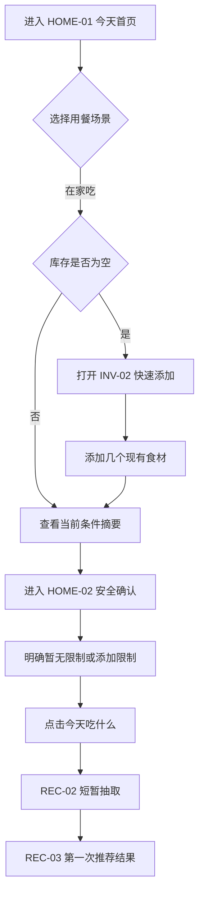

### 21.2 返回用户 → 首页 → 快速推荐

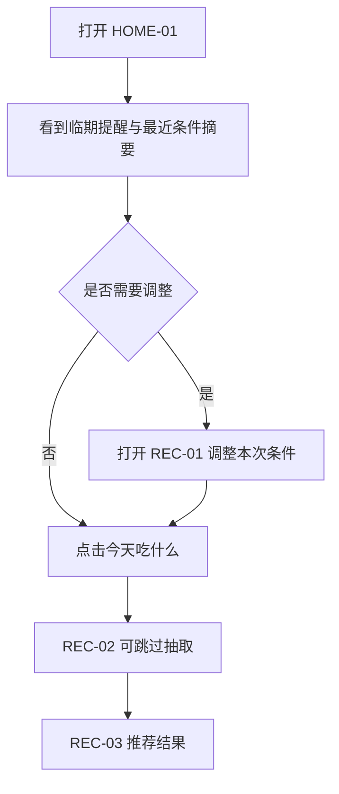

### 21.3 严格库存推荐

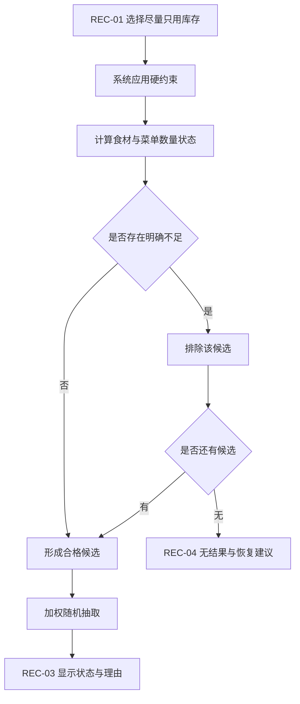

### 21.4 允许少量补买

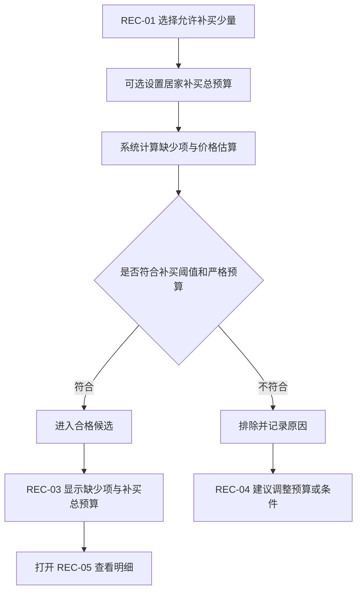

### 21.5 库存不足 / 未知 / 可能满足

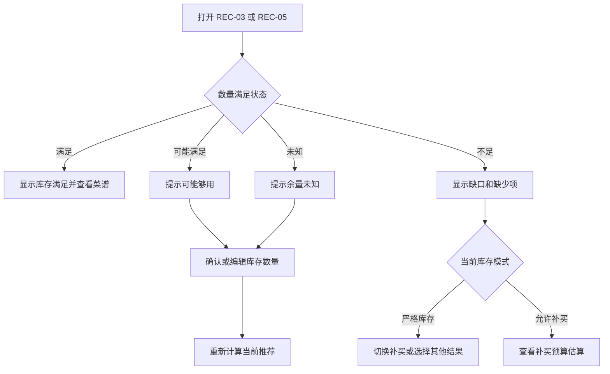

### 21.6 推荐 → 菜谱 → 制作 → 库存扣减

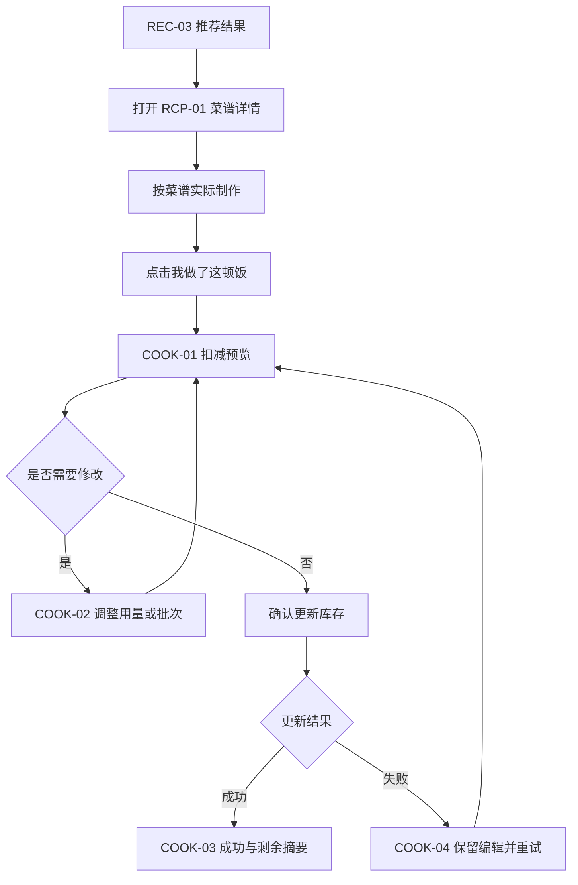

### 21.7 随机菜单

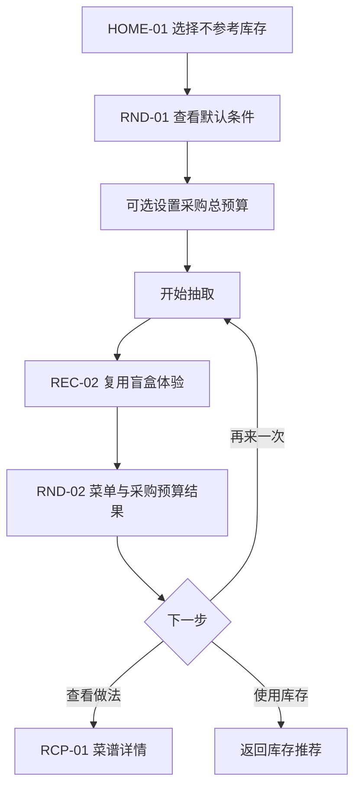

### 21.8 附近就餐

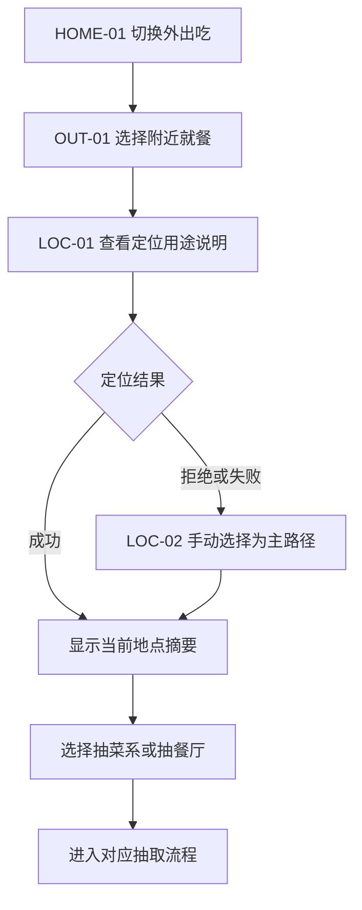

### 21.9 指定区域外出推荐

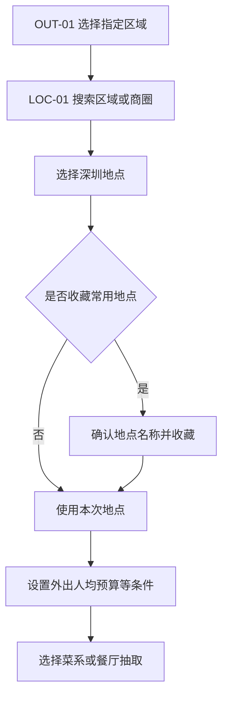

### 21.10 菜系 → 餐厅

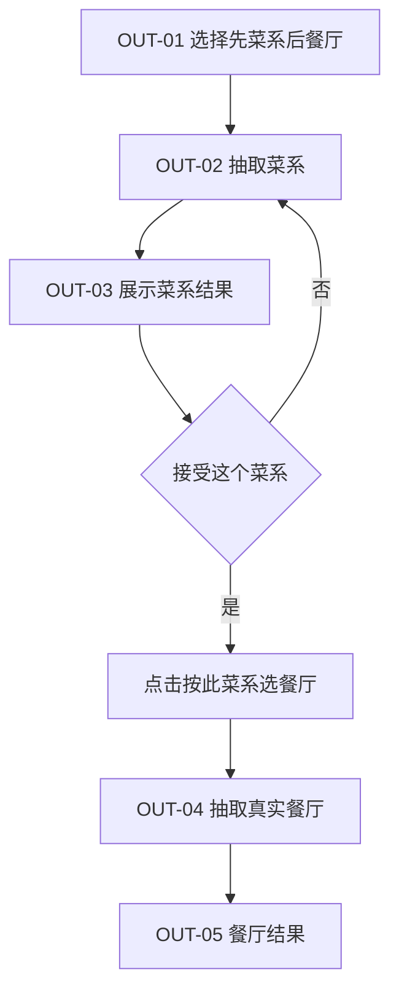

### 21.11 直接抽餐厅

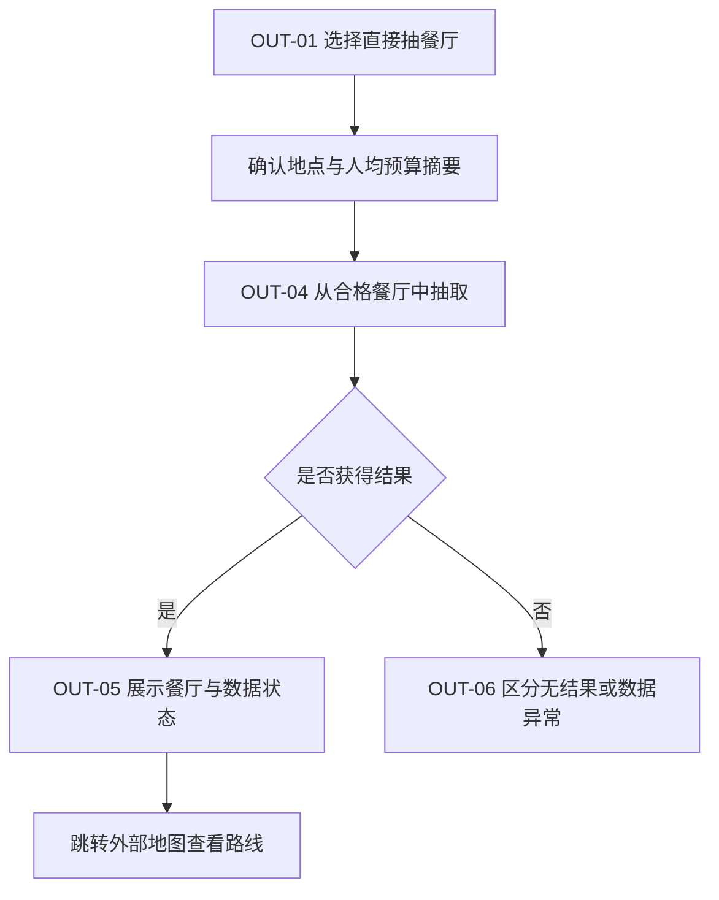

### 21.12 游客 → 手机号登录 → 数据合并

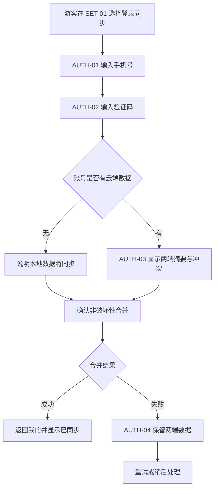

### 21.13 AI 辅助

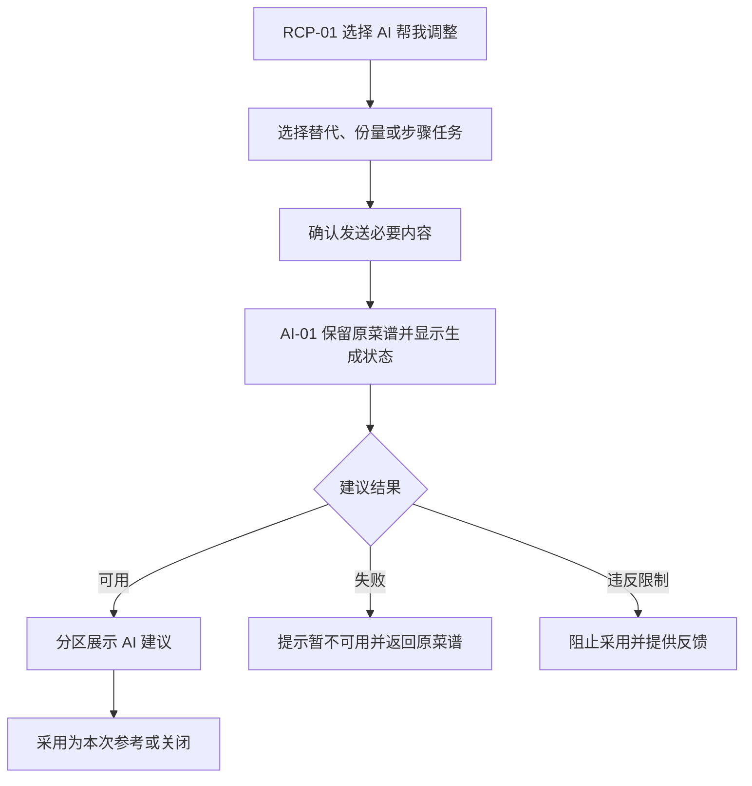

### 21.14 无推荐结果后的恢复

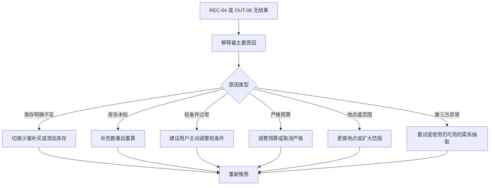

---

## 22. 核心页面 UX Specification

### 22.1 HOME-01 今天首页

- **页面目标**：让用户一眼知道当前是“在家/外出”、推荐上下文和最值得处理的事情，并立即开始决策。
- **信息优先级**：场景与主 CTA > 条件摘要 > 临期提醒/地点摘要 > 次要入口 > 登录状态。
- **页面结构**：顶部问候与轻量账号状态；在家/外出切换；上下文摘要卡；临期或地点提示；主 CTA；随机菜单或常用地点等次入口；底部导航。
- **主操作**：在家为“今天吃什么”；外出根据路径为“帮我选菜系/餐厅”。
- **次要操作**：调整条件、快速添加库存、切换随机菜单、管理地点。
- **状态**：默认；首次空库存；临期提醒；安全设置未确认；上下文数据加载；本地离线；返回用户恢复最近状态；主 CTA 因关键安全确认未完成而引导确认但不成为死按钮。
- **页面跳转**：进入 REC-01/02、OUT-01、INV-02、HOME-02；从结果或设置返回时恢复原状态。
- **数据展示规则**：不显示含义模糊的“预算”；只显示当前场景对应预算。临期只依据明确日期或标记。游客状态显示“仅保存在本设备”的轻提示。

### 22.2 INV-01 我的库存

- **页面目标**：快速确认“有什么、哪些该先吃、哪些数据需要补充”。
- **信息优先级**：临期/尽快食用 > 需确认余量 > 普通库存 > 常备项入口。
- **页面结构**：标题与摘要；筛选/搜索；需优先使用分组；其他库存列表；常备项入口；添加主 CTA。
- **主操作**：添加食材。
- **次要操作**：编辑、标记用完、筛选、进入批次和常备项。
- **状态**：默认；空库存；列表加载；保存中；加载失败；离线本地可用；标准映射待确认；长期未更新的 partial data。
- **页面跳转**：INV-02/03/04/05、HOME-01。
- **数据展示规则**：数量保留精确/约数/未知语义；多批次展示合计与最近临期信息；不在库存列表显示相对于某道菜的四态，因为四态依赖本次菜谱需求。

### 22.3 INV-03 添加/编辑食材

- **页面目标**：以最低成本保存食材，并允许用户在有意愿时补充精度。
- **信息优先级**：食材名称 > 数量和单位 > 日期/临期标记 > 批次与备注。
- **页面结构**：名称搜索与映射；数量类型及输入；单位；日期和“尽快食用”；批次选择；保存 CTA；危险操作区。
- **主操作**：保存食材。
- **次要操作**：保留自定义名称、作为新批次、合并、标记用完、删除。
- **状态**：新建；编辑；映射建议加载；映射失败；字段错误；保存中；保存成功；保存失败；离线保存；删除确认；未保存离开。
- **页面跳转**：从 INV-01/02/04 来，返回原页；映射不确定进入 INV-06。
- **数据展示规则**：名称唯一必填；数量可精确、约数或不填；日期可选；不同过期时间批次不得无提示合并；错误就近显示。

### 22.4 REC-01 推荐条件

- **页面目标**：让用户确认“这次怎么推荐”，而不是完成一张偏好问卷。
- **信息优先级**：人数/餐次/结果形式/库存模式 > 当前场景预算 > 口味与营养 > 设为默认。
- **页面结构**：顶部当前摘要；基础条件；库存模式；按需出现的居家补买预算；折叠的口味、时间和营养；固定主 CTA。
- **主操作**：开始抽取。
- **次要操作**：恢复最近状态、设为默认、关闭返回。
- **状态**：默认；有本次修改；硬约束冲突；严格预算数据不足提示；提交加载；无可用库存提示；离线但本地候选可用/不可用。
- **页面跳转**：来自 HOME-01/REC-03，进入 REC-02，关闭回来源页。
- **数据展示规则**：三种预算只出现当前场景对应一种；本次修改不自动改长期偏好；硬约束摘要始终可见且可进入 SET-02。

### 22.5 REC-02 盲盒抽取

- **页面目标**：提供轻微仪式感，并明确系统正在从合格候选中抽取。
- **信息优先级**：抽取状态 > 可跳过操作 > 当前条件简短摘要。
- **页面结构**：中心卡片洗牌/翻面；文案“正在从符合条件的菜单中抽取”；跳过；结果进入过渡。
- **主操作**：查看结果；若自动进入则主操作表现为可立即跳过。
- **次要操作**：取消返回条件。
- **状态**：动效进行；已跳过；候选计算中；无结果；错误；Reduce Motion 静态；重复点击禁用。
- **页面跳转**：REC-03、RND-02、OUT-03/05 或无结果页；返回 REC-01/OUT-01。
- **数据展示规则**：不展示伪随机滚动名单或未经筛选的菜品；等待超过可感知阈值时显示真实进度反馈，不用无限动画掩盖加载。

### 22.6 REC-03 居家推荐结果

- **页面目标**：帮助用户接受或快速否决一个合理结果，并理解为何推荐。
- **信息优先级**：菜单和整体库存状态 > 推荐理由 > 缺少项/补买预算 > 时间和营养 > 次要反馈。
- **页面结构**：结果主卡；库存四态标签；推荐理由；菜品组合；缺少项与预算；营养估算；主 CTA；反馈动作。
- **主操作**：查看菜谱。
- **次要操作**：再来一次、调整条件、收藏、今天不想吃、不喜欢、不再推荐。
- **状态**：完整结果；可能满足；未知；补买不足；预算估算不完整；营养 partial；图片缺失；收藏/反馈成功；数据错误；离线已有结果。
- **页面跳转**：RCP-01、REC-05、REC-01/02、FBK-01。
- **数据展示规则**：总体四态带文字和依据入口；补买金额为整顿总额；营养带估算；常备项满足注明假设；推荐理由必须对应真实规则。

### 22.7 RCP-01 菜谱详情

- **页面目标**：让用户完成准备和烹饪，并在实际制作后进入扣减闭环。
- **信息优先级**：安全限制 > 食材/用量 > 步骤 > 营养和来源 > AI 辅助。
- **页面结构**：标题摘要；安全提示；份数；食材分组；步骤；营养估算；AI 入口；来源与反馈；固定主 CTA。
- **主操作**：我做了这顿饭。
- **次要操作**：调整份数、AI 帮我调整、收藏、反馈、查看库存依据。
- **状态**：默认；份数重算；食材 partial；营养缺失；加载失败；AI 可用/不可用；自定义菜谱；离线已缓存内容；主 CTA 提交前保持可用。
- **页面跳转**：来自 REC-03/RND-02，进入 COOK-01、AI-01、REC-05、FBK-01。
- **数据展示规则**：原始结构化菜谱不可被 AI 覆盖；营养/用量/预算均保留估算语义；过敏原提示在步骤之前可见。

### 22.8 COOK-01 库存扣减预览

- **页面目标**：让用户基于实际使用量确认库存更新，避免自动误扣。
- **信息优先级**：确认规则 > 每项消耗与批次 > 扣减后余量 > 最终确认。
- **页面结构**：说明；扣减项列表；临期批次建议；跳过项；变化摘要；固定确认 CTA。
- **主操作**：确认更新库存。
- **次要操作**：修改单项、本次不扣减、取消。
- **状态**：默认；未知数量待处理；约数；多批次；无可扣库存；提交中；成功；失败并保留编辑；离线无法同步但本地策略明确；确认按钮因必需选择未完成而 disabled。
- **页面跳转**：来自 RCP-01，进入 COOK-02/03/04，取消回菜谱。
- **数据展示规则**：优先建议临期批次但不静默决定；显示扣减后“约剩余”；补买食材不自动入库；提交整体成功或整体失败。

### 22.9 RND-02 随机菜单结果

- **页面目标**：在不参考库存时给出完整菜单和采购成本概览。
- **信息优先级**：菜单 > 采购总预算估算 > 人数/时间 > 营养 > 菜谱入口。
- **页面结构**：菜单主卡；采购食材与总预算；营养；主 CTA；切回库存与反馈。
- **主操作**：查看菜谱。
- **次要操作**：再来一次、调整条件、切回库存推荐、收藏。
- **状态**：完整；预算未知/估算不完整；营养 partial；图片缺失；无结果；离线；收藏成功。
- **页面跳转**：RCP-01、RND-01、REC-02、HOME-01。
- **数据展示规则**：预算为整顿菜单采购总额，不显示库存四态，不写入库存，不进入扣减闭环。

### 22.10 OUT-01 外出推荐入口

- **页面目标**：用最少选择确定地点、预算和抽取路径。
- **信息优先级**：地点 > 附近/指定区域 > 抽菜系/餐厅路径 > 人均预算 > 其他偏好。
- **页面结构**：地点摘要；范围选择；抽取路径卡；条件摘要；主 CTA；切回在家。
- **主操作**：按当前路径开始推荐。
- **次要操作**：选择地点、调整人均预算、切换路径、切回在家。
- **状态**：地点未选；定位可用；定位拒绝；常用地点；外出条件加载；严格预算提示；离线/第三方不可用。
- **页面跳转**：LOC-01/02、OUT-02/04、HOME-01、SET-05。
- **数据展示规则**：预算只称外出人均预算；无地点时 CTA 引导选地点而非无反馈禁用；不出现下单、订座或店内菜品入口。

### 22.11 LOC-01 地点选择

- **页面目标**：在不依赖强制定位的情况下得到一个深圳搜索中心。
- **信息优先级**：当前定位/手动搜索 > 常用地点 > 深圳区域与商圈 > 收藏。
- **页面结构**：定位用途说明；使用当前位置；搜索输入；常用地点；区域/商圈列表；确认 CTA。
- **主操作**：使用此地点。
- **次要操作**：尝试定位、收藏/取消收藏、返回。
- **状态**：初始；请求权限；定位中；成功；拒绝；超时；搜索无结果；深圳范围外；第三方不可用；离线常用地点可见。
- **页面跳转**：来自 OUT-01，成功返回 OUT-01；失败可进入 LOC-02 或继续手动选择。
- **数据展示规则**：不保存轨迹；收藏需用户主动确认；深圳范围外明确说明餐厅推荐范围，但不影响居家功能。

### 22.12 OUT-03 菜系抽取结果

- **页面目标**：让用户快速接受一个菜系，并自然进入餐厅选择。
- **信息优先级**：菜系名称与简短解释 > 与条件匹配理由 > 餐厅抽取 CTA。
- **页面结构**：菜系结果卡；理由；人均预算/口味摘要；主 CTA；换一个。
- **主操作**：按此菜系选餐厅。
- **次要操作**：换一个菜系、调整条件、直接抽餐厅。
- **状态**：默认；候选少；无结果；动效已跳过；收藏偏好影响说明；离线只可使用可用菜系数据。
- **页面跳转**：OUT-04、OUT-02、OUT-01。
- **数据展示规则**：不在此页承诺某家餐厅或具体菜品；外出人均预算只是菜系/后续餐厅筛选上下文。

### 22.13 OUT-05 餐厅推荐结果

- **页面目标**：用可靠最低信息支持用户决定是否前往，并可跳转地图。
- **信息优先级**：名称/类别 > 距离/地址 > 营业状态 > 人均消费 > 来源时间 > 评分等次要信息。
- **页面结构**：餐厅主卡；位置与营业；人均预算匹配；可选数据；数据来源；主 CTA；反馈动作。
- **主操作**：去地图查看路线。
- **次要操作**：再来一次、收藏、调整条件、反馈。
- **状态**：完整；营业未知；人均未知；评分/图片 partial；第三方数据过期；外部地图跳转失败；无结果；离线不可用。
- **页面跳转**：外部地图、OUT-04/01、FBK-02。
- **数据展示规则**：未知不推断；严格人均预算不把未知标为符合；展示最近更新时间；无店内菜品、配送、下单、排队或订座。

### 22.14 SET-02 至 SET-06 偏好设置

- **页面目标**：维护长期默认，不让低频设置侵入每次推荐。
- **信息优先级**：安全限制 > 当前分组核心字段 > 估算说明 > 恢复默认。
- **页面结构**：分组标题与作用说明；字段/Chip/开关；影响范围提示；固定保存 CTA。
- **主操作**：保存当前分组。
- **次要操作**：清除单项、恢复默认、返回。
- **状态**：默认；未保存修改；验证错误；保存中；成功；失败；离线本地保存/云同步待处理；严格预算数据能力提示。
- **页面跳转**：来自 SET-01/条件页，保存后回来源。
- **数据展示规则**：三种预算分区且单位语义清楚；营养显示估算声明；安全限制变更会提示当前结果需重新推荐；本次条件不自动覆盖长期值。

### 22.15 AUTH-01 至 AUTH-04 登录与数据合并

- **页面目标**：在不牺牲游客数据的前提下完成验证码登录和非破坏性同步。
- **信息优先级**：手机号/验证码 > 本地数据安全说明 > 合并摘要与冲突 > 完成状态。
- **页面结构**：手机号页；验证码页；本地/云端摘要；冲突分组；合并 CTA；失败恢复。
- **主操作**：按阶段分别为“获取验证码”“登录”“合并并继续”“重试合并”。
- **次要操作**：继续游客使用、修改手机号、重新发送、查看差异、稍后合并。
- **状态**：输入默认；验证码发送中/已发送/过期/错误；登录失败；云端为空；有冲突；合并中；成功；失败；离线；重复提交 disabled。
- **页面跳转**：从 SET-01 或同步提示进入，成功回“我的”，失败停留 AUTH-04 且保留两端数据。
- **数据展示规则**：不展示完整手机号；不默认覆盖任一端；退出登录与注销不混淆；失败不破坏游客数据。

---

## 23. 页面状态与异常恢复

### 23.1 通用页面状态

| 状态 | 设计要求 | 禁止做法 |
|---|---|---|
| Default | 显示可执行主任务与必要上下文 | 首屏堆满所有筛选项 |
| Loading | 保留布局和已有内容，说明正在处理什么 | 用长动画掩盖未知等待 |
| Empty | 说明为什么为空并提供一个最合理主操作 | 只显示空白或“暂无数据” |
| Error | 说明失败对象与恢复方式，保留用户输入 | 清空表单或只显示错误码 |
| Success | 简短确认并引导下一步 | 用不可跳过庆祝动画阻塞 |
| Disabled | 说明为何暂不可操作以及如何恢复 | 可点击外观但无响应 |
| Partial data | 对缺失字段逐项标记未知或估算不完整 | 用默认值冒充真实数据 |
| Offline | 区分本地仍可用与必须联网的能力 | 把所有页面统一锁死 |
| Third-party unavailable | 明确是哪类外部数据不可用并提供降级 | 将外部失败描述为没有结果 |

### 23.2 关键数据状态表达

| 数据 | 显示规则 | 说明/动作 |
|---|---|---|
| 模糊库存 | 数量前显示“约”，保留原单位 | 允许用户编辑实际余量 |
| 临期 | 文字“临期/尽快食用” + 辅助符号 | 查看批次或标记已用完 |
| 满足 | “库存满足”文字标签 | 展开判断依据 |
| 可能满足 | “可能够用”文字标签 | 确认或补充余量 |
| 不足 | “库存不足”文字标签 | 查看缺少项/切换补买 |
| 未知 | “余量未知”文字标签 | 补充数量或单位 |
| 营养 | 数值旁固定“估算” | 展开误差说明 |
| 补买预算 | “预计补买总额” | 不含已有库存价值 |
| 随机菜单预算 | “预计采购总额” | 对整顿菜单，不按人 |
| 外出预算 | “人均估算” | 可辅助展示人数对应总额 |
| 预算未知 | 明确“预算未知/估算不完整” | 严格模式给出调整入口 |
| 营业未知 | 明确“营业状态未知” | 提醒用户出发前确认 |
| AI 建议 | 独立“AI 辅助建议”容器 | 原菜谱未修改，可报告问题 |

### 23.3 异常到恢复动作映射

| 异常 | 主恢复动作 | 次恢复动作 | 保留内容 |
|---|---|---|---|
| 库存为空 | 快速添加食材 | 随机菜单 | 已设偏好 |
| 严格库存无结果 | 切换少量补买或调整条件 | 添加库存 | 当前条件 |
| 数量未知 | 补充数量 | 在提示下继续查看 | 当前结果 |
| 预算估算不完整 | 取消严格预算/调整预算 | 查看缺失价格项 | 当前条件 |
| AI 不可用 | 返回原始菜谱 | 重试 | 菜谱与阅读位置 |
| 定位拒绝 | 手动选择地点 | 重试定位 | 外出条件 |
| 餐厅数据不可用 | 重试/调整地点 | 只抽菜系 | 地点与预算 |
| 验证码失败 | 修正并重试 | 继续游客 | 本地数据 |
| 合并失败 | 重试合并 | 稍后处理 | 本地与云端原数据 |
| 扣减失败 | 重试更新 | 暂不更新 | 所有扣减编辑 |

---

## 24. 核心盲盒交互方案比较与推荐

### 24.1 方案比较

| 方案 | 描述 | 趣味性 | 效率 | 手机适配 | 可访问性 | 等待感 | 高频适用 | Reduce Motion |
|---|---|---|---|---|---|---|---|---|
| A. 卡片洗牌后翻面 | 少量结果卡短暂叠放/洗牌，主卡翻面呈现结果 | 中高 | 高 | 高 | 高，语义可保持简单 | 低 | 高 | 直接静态换卡即可 |
| B. 轻量抽签 | 一张“今日签”从候选中浮出，点击揭晓 | 中 | 高 | 高 | 高，但需避免手势依赖 | 低 | 中高 | 直接显示签面 |
| C. 菜品卡片横向掠过 | 数张合格卡快速经过，停在结果 | 高 | 中 | 中高 | 中，动态较强 | 中 | 中 | 改为无滚动静态结果 |

不采用复杂老虎机、长时间转盘、不可跳过揭晓或展示大量未筛选候选的伪随机动画。

### 24.2 第一版推荐：卡片洗牌后翻面

推荐理由：

- 与“菜单卡片”内容结构天然一致，可在居家、随机菜单、菜系和餐厅中复用；
- 动效可以很短，用户点按后立即提供“跳过并看结果”；
- 不需要精准拖拽或复杂手势；
- 结果翻面后可顺势成为结果主卡，空间连续性好；
- Reduce Motion 下直接交叉淡入或静态呈现，不损失信息；
- 高频使用不易疲劳，也不暗示赌博式体验。

### 24.3 动效规则

- 只动主卡和少量背景卡，不让整页元素同时运动。
- 用户再次点击或选择跳过时立即结束，不阻塞输入。
- 候选计算未完成时显示真实加载反馈；动画不是后台等待的遮羞布。
- 读屏用户在结果就绪时收到动态区域通知，焦点移动到结果标题。

---

## 25. 关键组件清单

| 组件 | 用途与场景 | 信息层级 | 主要状态 | 手机/桌面表现 |
|---|---|---|---|---|
| 场景切换 | HOME-01 在家/外出 | 一级场景 | 选中、未选、焦点 | 手机段控；桌面同语义横向控件 |
| 条件摘要 | 首页、结果、外出入口 | 主上下文 | 默认、已修改、缺关键条件 | 手机单行可展开；桌面可展示更多摘要 |
| 食材 Chip | 快速添加、偏好、菜谱 | 辅助选择 | 默认、选中、禁用、错误映射 | 手机可换行；桌面紧凑排列 |
| 库存卡片 | INV-01 | 管理主信息 | 正常、临期、未知、多批次、用完 | 手机单列；桌面列表/卡片结合 |
| 临期标签 | 首页、库存、扣减 | 高优先状态 | 临期、尽快食用 | 文字+符号，尺寸随密度变化 |
| 库存满足标签 | 结果、菜谱、缺少项 | 决策关键 | 满足、可能满足、不足、未知 | 手机简标签+Sheet 详情；桌面可并排明细 |
| 菜谱/菜单卡片 | 推荐与收藏 | 内容主卡 | 默认、收藏、图片缺失、partial | 手机单主卡；桌面主卡+信息侧栏 |
| 推荐理由标签 | 推荐结果 | 解释辅助 | 临期、库存匹配、营养、偏好 | 默认展示最重要一至两项，更多折叠 |
| 缺少食材提示 | 补买结果 | 决策关键 | 关键、普通、可选、价格未知 | 手机分组 Sheet；桌面侧栏 |
| 预算状态 | 三场景条件与结果 | 场景关键 | 未设置、区间、严格、未知、超出 | 始终带完整场景名称 |
| 营养估算 | 居家结果与菜谱 | 次要参考 | 可用、partial、缺失 | 摘要+展开说明 |
| 过敏原警告 | 安全确认、结果、菜谱 | 最高安全信息 | 已设置、未确认、冲突 | 靠前且不被折叠隐藏 |
| 推荐结果卡 | REC/RND/OUT | 页面主体 | loading、success、partial、error | 手机单列；桌面居中主卡 |
| 餐厅卡片 | OUT-05、收藏 | 页面主体 | 营业、未知、预算未知、图片缺失 | 手机纵向；桌面信息并排 |
| 地点选择器 | LOC-01 | 任务主控件 | 未选、定位中、成功、拒绝、失败 | 手机全屏/Sheet；桌面 Modal |
| Filter Sheet | REC-01 等条件调整 | 临时任务 | 默认、修改、验证错误、提交 | 手机 Bottom Sheet；桌面侧 Drawer/Modal |
| Bottom Sheet | 快速添加、详情、反馈、AI | 临时任务 | 半高、全高、loading、error | 桌面替换为 Modal/Drawer |
| Toast | 收藏、撤销、轻成功 | 轻反馈 | success、undo、info | 不抢焦点，读屏友好 |
| Empty State | 库存、收藏、我的菜谱 | 恢复引导 | 初始空、筛选空 | 一个明确主操作 |
| Error State | 推荐、定位、第三方、登录 | 恢复引导 | 可重试、需调整、离线 | 原因与动作同一区域 |
| AI 建议区 | AI-01 | 来源隔离 | loading、可用、失败、不安全 | 手机全屏 Sheet；桌面对照栏 |
| 扣减预览项 | COOK-01 | 变更确认 | 精确、约数、未知、多批次、跳过 | 手机逐项卡；桌面表格式列表 |
| 数量输入 | 库存与扣减 | 关键表单 | 精确、约数、空、单位错误 | 使用合适输入键盘与可见 Label |
| 主 CTA | 所有核心页 | 唯一强操作 | 默认、pressed、loading、disabled | 手机靠近拇指区域；桌面随内容对齐 |

---

## 26. 手机端设计原则

### 26.1 主导航与单手操作

- 底部导航固定“今天 / 库存 / 我的”，不超过必要项。
- 首页和长详情的主 CTA 可固定在底部安全区域，正文预留空间避免被遮挡。
- 图标按钮具有完整可点击区域和文字或无障碍名称。
- 不依赖横向滑动完成关键操作；手势必须有可见按钮替代。

### 26.2 Bottom Sheet 使用原则

- 适合条件调整、快速添加、单项编辑、缺少项、地点选择、AI 和反馈。
- 内容较长、需要键盘或涉及安全确认时允许扩展为全屏。
- Sheet 提供标题、关闭/返回和明确主操作；有未保存内容时阻止误关闭或要求确认。
- 打开后焦点进入 Sheet，关闭后返回触发控件。

### 26.3 表单输入

- 所有字段有可见 Label，不只使用占位符。
- 数量、预算、手机号和验证码使用适合的输入模式。
- 验证在用户完成输入后出现，不在每次按键时制造噪音。
- 长表单分段并保存草稿；首次推荐不使用长表单。

### 26.4 推荐结果

- 首屏优先看到结果、四态/营业状态和主理由。
- 次要解释、营养、来源和反馈向下展开。
- 再来一次不比“查看菜谱/去地图”更强，避免用户陷入无限重抽。

### 26.5 库存与地点

- 库存使用单列扫描和分组；批次细节进入详情。
- 地点选择优先当前定位、常用地点和搜索，不在首版内设计复杂地图拖拽交互。
- 屏幕键盘出现时主操作保持可见或可自然滚动到达。

---

## 27. 桌面端响应式原则

### 27.1 内容宽度与导航

- 使用受控的最大阅读宽度，避免正文和表单横向铺满。
- 三项主导航可转为固定侧栏或紧凑顶部导航；顺序与语义保持一致。
- 任务流页面保留清晰返回路径，不因为空间更大而同时展示所有步骤。

### 27.2 双栏使用

- 库存：左侧列表，右侧批次详情或编辑。
- 推荐结果：左侧主结果和图片，右侧库存状态、理由和预算摘要。
- 菜谱：左侧食材与状态，右侧步骤；窄桌面自动回落单栏。
- 餐厅结果：左侧主卡，右侧地点、营业、人均和来源信息。
- 数据合并：左侧类别摘要，右侧冲突详情。

### 27.3 Modal 与 Drawer

- 手机 Bottom Sheet 在桌面可替换为居中 Modal 或侧 Drawer。
- 简单确认使用 Modal；需要浏览长列表或保留主页面上下文时使用 Drawer。
- 不使用嵌套 Modal；复杂任务转为独立页面。

### 27.4 大空间原则

- 更大屏幕用于并排比较与减少往返，不用于增加无关推荐数量。
- 盲盒结果仍聚焦单一抽取，不变成多卡候选墙。
- 桌面支持完整键盘导航、清晰焦点和合理阅读顺序。

---

## 28. 可访问性设计

### 28.1 状态与文本

- 满足、可能满足、不足、未知必须有完整文字；临期、预算、营业和 AI 状态同样不能只靠颜色。
- 正文和辅助文字保持清晰对比，不用极浅灰承载关键信息。
- 图片有含义时提供替代文本；装饰图片不重复朗读。

### 28.2 键盘与焦点

- Tab 顺序与视觉顺序一致；所有核心操作可用键盘完成。
- 页面跳转后焦点进入主标题；结果生成后焦点移到结果标题或提供可读动态通知。
- Modal/Sheet 打开时焦点被限制在内部，关闭后回到触发控件。
- 永远保留清晰焦点样式，不通过移除轮廓获得“干净”外观。

### 28.3 表单与错误

- 输入均有可见 Label、说明和语义关联。
- 错误显示在对应字段附近，并说明原因和修复方式。
- 多错误表单顶部提供摘要，并将焦点移到首个错误。
- Disabled 状态同时通过语义属性、视觉弱化和原因说明表达。

### 28.4 动态内容

- 加载、保存成功、库存更新、验证码和 AI 结果通过适当动态区域通知，不强制抢焦点。
- Toast 不成为唯一反馈，关键操作在页面中保留可确认状态。
- 盲盒动效可跳过；尊重系统 Reduce Motion，并允许产品设置覆盖为更少动效。

### 28.5 触控与可读性

- 触控目标和间距满足主流移动平台的舒适操作要求。
- 支持浏览器缩放和更大文字，不截断关键预算、状态和 CTA 文案。
- 不把关键动作放在只能悬停发现的位置。

---

## 29. Figma 原型范围建议

### 29.1 P0：第一轮必须原型

目标是验证核心减浪费闭环，而不是展示全部功能。

- 新游客在家场景；
- 安全确认；
- 空库存与快速添加；
- 有临期食材的库存首页；
- 默认条件摘要与按需调整；
- 盲盒抽取及 Reduce Motion 静态路径；
- 居家推荐结果的“满足 / 可能满足 / 不足 / 未知”关键状态；
- 严格库存与少量补买；
- 菜谱详情；
- 我做了这顿饭；
- 扣减预览、编辑、多批次临期优先；
- 库存更新成功与失败；
- 无结果恢复。

### 29.2 P1：第二轮原型

- 随机菜单与采购总预算；
- 外出入口、定位/手动地点；
- 菜系 → 餐厅与直接抽餐厅；
- 营业未知、人均未知和第三方异常；
- 手机号登录与数据合并；
- 长期偏好和三种预算；
- 收藏、四类反馈和永久屏蔽；
- AI 辅助与原菜谱区分；
- 我的私有菜谱。

### 29.3 P2：无需第一轮详细原型

- 内部内容管理完整界面；
- 注销和数据删除完整文案流程；
- 所有低频设置；
- 极端合并冲突组合；
- 低概率第三方异常的全部分支；
- 桌面内部管理细节。

P2 仍需在信息架构中存在，但可以使用低保真流程说明或单页状态，不占用第一轮核心验证资源。

---

## 30. 第一轮 Figma Frame 清单与 Prototype Links

### 30.1 Frame 清单

| Frame | 页面 ID | 目的 | 形式 |
|---|---|---|---|
| P0-01 首次首页-空库存 | HOME-01 | 验证场景和首要入口是否清楚 | 独立 Frame |
| P0-02 安全确认 | HOME-02 | 验证短安全 Gate 不像问卷 | Overlay/Bottom Sheet |
| P0-03 快速添加 | INV-02 | 验证只填名称即可连续添加 | Overlay/Bottom Sheet |
| P0-04 库存首页-含临期 | INV-01 | 验证临期优先和批次摘要 | 独立 Frame |
| P0-05 推荐条件-默认摘要 | REC-01 | 验证默认值与渐进披露 | Overlay/Bottom Sheet |
| P0-06 推荐条件-允许补买 | REC-01 | 验证补买总预算语义 | Component Variant/独立状态 |
| P0-07 盲盒抽取 | REC-02 | 验证短、可跳过的仪式感 | 独立 Frame |
| P0-08 推荐结果-满足 | REC-03 | 验证结果优先级和理由 | 独立 Frame |
| P0-09 推荐结果-可能/未知 | REC-03 | 验证不确定状态理解 | Component Variant，可做测试 Frame |
| P0-10 推荐结果-补买不足 | REC-03 | 验证缺少项和补买预算 | 独立 Frame |
| P0-11 库存状态明细 | REC-05 | 验证四态依据与修正路径 | Overlay/Bottom Sheet |
| P0-12 菜谱详情 | RCP-01 | 验证安全、食材、步骤与主 CTA | 独立 Frame |
| P0-13 扣减预览 | COOK-01 | 验证确认后才更新库存 | 独立 Frame |
| P0-14 编辑扣减项 | COOK-02 | 验证实际用量和批次调整 | Overlay/Bottom Sheet |
| P0-15 更新成功 | COOK-03 | 验证闭环完成反馈 | 独立 Frame |
| P0-16 更新失败 | COOK-04 | 验证编辑保留与重试 | 独立 Frame |
| P0-17 无推荐结果 | REC-04 | 验证不突破硬约束的恢复 | 独立 Frame |
| P0-18 返回首页-库存已更新 | HOME-01 | 验证闭环后的状态变化 | 独立 Frame |

### 30.2 主要 Prototype Links

```text
P0-01 → P0-03 → P0-04 → P0-01
P0-01 → P0-02 → P0-05 → P0-07 → P0-08
P0-05 → P0-06 → P0-07 → P0-10
P0-08/P0-09/P0-10 → P0-11 → 返回原结果
P0-08/P0-10 → P0-12 → P0-13 → P0-14 → P0-13
P0-13 → P0-15 → P0-18
P0-13 → P0-16 → P0-13
P0-07 → P0-17 → P0-05 或 P0-03
```

### 30.3 独立 Frame 与 Component Variant

应做独立 Frame：

- 会改变主操作或流程分支的状态：空库存、无结果、补买结果、扣减失败、成功闭环；
- 需要用户研究完整理解的状态：安全确认、可能满足/未知、补买预算。

适合 Component Variant：

- 库存四态标签；
- 临期/普通/尽快食用标签；
- 预算未设置/区间/严格/未知/超出；
- 收藏/反馈按钮状态；
- 主 CTA 默认/按下/loading/disabled；
- 图片可用/占位；
- 营养估算可用/partial/缺失；
- 餐厅营业、人均和数据新鲜度状态，供 P1 使用。

适合 Overlay / Bottom Sheet：

- HOME-02 安全确认；
- INV-02 快速添加；
- REC-01 条件调整；
- REC-05 库存和缺少项明细；
- COOK-02 扣减项编辑；
- AI-01 AI 辅助；
- LOC-01 地点选择；
- FBK-01/02/03 问题反馈。

### 30.4 第一轮原型需验证的核心问题

1. 用户是否理解首页主线是基于库存做决定，而不是搜索菜谱？
2. 用户能否在不填写完整档案的情况下开始推荐？
3. 安全确认是否足够明确，又没有产生问卷感？
4. “满足 / 可能满足 / 不足 / 未知”能否仅凭文案和结构被正确区分？
5. 严格库存与允许少量补买的差异是否清楚？
6. 用户是否理解补买预算是整顿菜单的额外采购总额？
7. 盲盒是否有轻微仪式感但不让用户觉得等待？
8. 推荐理由是否足以建立信任，而不显得像算法说明书？
9. 用户是否知道查看菜谱不会扣库存？
10. 扣减预览是否让用户愿意确认实际用量，尤其是约数和多批次？
11. 扣减失败时，用户是否相信之前的编辑没有丢失？
12. 完成后返回首页，用户是否能感知临期食材已被消耗和库存已更新？

---

## 31. 待产品确认事项

### 31.1 架构级待确认

暂无。PRD V0.2 的核心流程、MVP 边界和数据语义可以通过上述 UX 架构落地，未发现必须修改产品需求才能继续的问题。

### 31.2 不阻塞 Figma 的上线配置项

以下内容继续按 PRD 作为配置或测试校准项，不在本阶段擅自固定：

- 首批菜谱数量及中西餐比例；
- 默认临期提前天数；
- 允许补买少量的阈值；
- 三种预算默认区间；
- 不同人数的默认菜品数量；
- 外出默认距离和最大范围；
- 数据新鲜度标准；
- 短期回避和近期重复窗口；
- 短信及日志保留相关规则。

### 31.3 设计交付自检结论

- 与 PRD 冲突：未发现；
- 非 MVP 功能误加入：未发现；
- 核心流程入口、结果、异常恢复：已覆盖；
- 手机优先：已在导航、Sheet、CTA、表单、结果和地点选择中明确；
- 推荐前长表单：已通过默认值、条件摘要和渐进披露避免；
- Figma 原型依据：已提供页面 ID、P0/P1/P2、Frame、Variant、Overlay 和 Prototype Links；
- 技术方案、代码、供应商或 Figma 文件：未创建。
---

## 32. V2.0 UX Delta：购买时长优先提醒

### 32.1 继承范围

本节是 2026-08-26 批准的 V2.0 增量，不重做既有信息架构、页面 ID、导航或五条核心流程。V2.0 保留数量满足四态、补买预算、盲盒、菜谱阅读、制作预览、用户可编辑扣减、原子提交、Reduce Motion 和响应式原则。若本节与前文“临期 / 到期 / 尽快食用”活跃界面语义冲突，Portfolio MVP V2.0 以本节为准。

### 32.2 信息层级

库存相关信息始终分成两层，避免把“有多少”与“买了多久”混成一个状态：

1. 数量层：数量、单位、约数/未知，以及相对菜谱需要量的满足 / 可能满足 / 不足 / 未知；
2. 购买时间层：今天购买、购买 N 天、建议优先使用、已购买较久、购买时间未知或日期异常。

购买时长不得替代数量四态。购买日期未知不等于余量未知；余量满足也不代表食材安全。

### 32.3 库存卡片与批次表达

| 数据状态 | 主文案 | 辅助文案 / 动作 | 强调层级 |
|---|---|---|---|
| 0 天 | 今天购买 | 无额外优先提示 | 普通 |
| 1–4 天 | 购买 N 天 | 可编辑购买日期 | 普通 |
| 5–6 天 | 已购买 N 天 | 建议优先使用 | 中等；文字、符号和边框共同表达 |
| ≥7 天 | 已购买 N 天 | 使用前请确认食材状态 | 较高但中性，不使用危险/过期图标 |
| 未填写 | 购买时间未知 | 补充购买日期 | 低强调、可操作 |
| 无效/未来 | 购买日期需要检查 | 日期不能晚于今天；进入编辑 | 错误态，不能显示负天数 |

同一食材多批次时，列表摘要显示最需要关注的合法、已知数量大于 0 的批次；批次明细仍逐项显示。数量未知批次可显示购买时间，但不应显示为“推荐已优先”；数量为 0 的批次不进入提醒。

### 32.4 录入与日期校验

- INV-02 快速添加仍允许只填名称并继续；购买日期属于“补充详情”。
- INV-03 将“预计到期日期”和“尽快食用”替换为一个可选的“购买日期”字段。
- 日期输入最大值为用户本地今天；前端属性只是辅助，提交时仍需校验 YYYY-MM-DD 是否真实存在且不晚于今天。
- future/invalid 错误就近关联到字段，说明原因和修正方式；焦点移到字段，未修正时不得把异常值保存为有效 purchasedOn。
- 已经存在的异常日期按“购买日期需要检查”显示并按 unknown 处理，不出现负天数。

### 32.5 首页库存提醒

HOME-01 的提醒按以下顺序呈现：

1. “N 类食材建议优先考虑”；
2. 其中最早的有效批次：“最早已购买 N 天”；
3. 常驻安全边界：“购买时长仅供整理库存参考，不能判断食材是否安全。”

5–6 天与 ≥7 天均计入提醒数量；unknown、future、invalid、数量未知和数量为 0 的批次不计入。无优先批次时显示“当前没有按购买时间优先的食材”，不得改写为“没有临期风险”。

### 32.6 推荐结果与菜谱

- REC-03 结果卡把真实参与加权的证据放在库存四态之后，默认展示一个最重要理由。
- 5–6 天模板：“西红柿已购买 6 天，本次优先考虑能够使用它的菜谱。”
- ≥7 天在理由后追加：“使用前请按实际保存情况确认食材状态。”
- 无有效 age bonus 时沿用库存匹配/条件符合理由，不展示内部 bonus、总分或 AI 表达。
- RCP-01 食材行可显示购买时长作为库存辅助信息，但安全说明不能被折叠隐藏；查看菜谱仍不改变库存。

### 32.7 扣减预览与编辑

- COOK-01 建议顺序为：合法已知 purchasedOn 从早到晚 → unknown/future/invalid；同日期和同状态保持原批次数组顺序。
- 每个扣减项显示批次 ID、购买时长或“购买时间未知”，并说明“优先顺序仅为建议”。
- ≥7 天批次显示中性状态确认提醒，不使用“临期批次优先”。
- COOK-02 继续允许修改数量和跳过；返回 COOK-01 后保留编辑。
- 升级前已保存的 pending deduction 显示“升级前保存的建议，请再次确认批次”，保留 amount、skip、batchId 和 unit。
- 最终确认、失败回滚和失败后保留编辑的交互不变。

### 32.8 Schema 升级反馈与恢复

在现有通用 Notice / Error / Confirmation Pattern 上增加状态，不新增全局导航：

- Migrated：首页一次性中性说明；可关闭，不阻塞主流程；关闭状态持久化。
- Damaged data：说明本地内容无法解析且原始内容未被自动覆盖；提供重试和明确确认后的演示数据恢复。
- Migration blocked：说明库存尚未升级、原数据仍保留；主操作为重试升级，次操作为明确确认后恢复演示数据。
- Storage write failed：说明保存未完成、当前可见数据未提交；保留表单或扣减编辑并允许重试。

恢复演示数据不能再是无确认的普通文本按钮；确认层必须说明会清除当前主数据和迁移备份。关闭错误或确认层后焦点回到触发点。

### 32.9 组件与可访问性增量

新增 Purchase Age Badge / Message 组件状态：Normal、Prioritize、Long-held、Unknown、Future-invalid；新增 Migration Notice 状态：Migrated、Damaged、Blocked、Write-failed。它们是既有组件的 V2.0 Variant，不新增页面 ID。

- 每种状态包含可读文字；颜色、图标和边框仅作辅助。
- “建议优先”和“使用前确认”的语气层级不同，但两者都不能采用代表食物危险或已过期的符号。
- 购买日期错误使用可见 label、就近错误、aria-describedby 和 aria-invalid。
- 首页提醒、推荐理由、迁移结果和扣减提交结果进入合适的 live region；动态通知不重复朗读整页。
- 320–1440px 下长文案可换行，不遮挡数量、状态或主 CTA。
- Reduce Motion 只影响呈现方式，不改变购买时长计算、理由或焦点顺序。

### 32.10 UX Delta 验收

- 用户可明确区分数量四态与购买时间状态。
- 0–4、5–6、≥7、unknown、future 均有可观察且不只靠颜色的状态。
- 首页提醒数字只来自可参与推荐的有效批次。
- 推荐理由与实际加权批次一致；无 bonus 时不伪造购买时间理由。
- 扣减较早购买批次在前，用户仍可编辑、跳过和取消。
- 迁移失败、损坏数据和写入失败有不同文案及恢复路径，且不静默重置。
- 活跃 V2.0 界面不把购买时长描述为过期、安全或可食用结论。
